PDF 补丁丁 (PDF Patcher) 使用手册
--------------------------------

作者：W. Jordan
电邮：wmjordan@163.com

# 软件功能简介

PDF补丁丁是一个用于修改PDF文件信息的工具。它具有以下功能：

- 修改文档（带“\*”号部分功能需通过高级补丁修改功能实现）：

  - 修改文档属性（如作者、主题、关键词等）。支持通过文件名重写文档属性。

  - 书签编辑器：添加、修改或删除PDF书签，设置书签的文字颜色、打开或收拢状态、点击后的跳转位置及页面缩放比例等修改PDF书签的功能。

  - **替换文档中使用的字体，或将字体嵌入到原本没有嵌入字体的PDF文档**。

  - 添加或修改页面内的链接。\*

  - 添加或更改PDF文档的逻辑页码编号。

  - 更改阅读器的初始设置（如显示比例、界面等）。

  - **统一页面尺寸**、裁剪或扩大页面尺寸。

  - 调整页面旋转方向。\*

  - 删除文档或页面内嵌的XML元数据。

  - 删除打开文档或页面时自动执行的动作。

  - 去除PDF文件复制、打印限制。

- 高级补丁修改功能（分两步进行）。

  - 首先导出信息文件（将PDF文档属性、阅读器初始状态、页码设置、页面设置、书签等信息导出成可编辑的XML文件。

  - 导入信息文件生成新文件：将上述信息文件和已有PDF文件合并，生成新的PDF文档，该PDF文档具有XML信息文件的设置（如页面设置、书签等）。

- 制作PDF文件：通过导入一批图片或已有PDF文件，生成包含图片及已有PDF文件指定页面范围的PDF文件（可挂上书签）。此功能还可拆分或合并PDF文件，并保留原文件的书签。

- 自动生成PDF书签：分析PDF文档的文本，自动生成书签。

- 文字识别：调用微软Office
  2003或2007的光学字符识别引擎，将PDF文档的图片转换为文字。识别结果可写入PDF文档。

- 无损导出PDF文件的图片。

- 提取PDF文件中指定的页面。

- 根据PDF文档元数据重命名PDF文件名。

- 分析文档结构：以树节点形式查看PDF文档结构，可将页面或文档内容导出成XML文件、二进制文件供PDF爱好者分析、调试之用。

- 支持打开并修改超过2G字节的超大PDF文档。

# 使用许可及授权协议

《PDF补丁丁》软件（以下简称本软件）受著作权法及国际条约条款和其它知识产权法及条约保护。

本软件对于最终用户是免费的，你可以在遵循本协议的基础上自由的使用和传播它，你一旦安装、复制或使用本软件，则表示您已经同意本协议条款。

如果你不同意本协议，请不要安装使用本软件。

1. 软件：软件是指《PDF补丁丁》软件以及它的更新、产品手册，以及在线文档等相关载体。

2. 你可以以任意方式分发数量不限的本软件的完整拷贝，但前提是：

   (1) 你必须提供本软件的完整版本，未经许可不得对软件乃至它的安装程序做任何修改；

   (2) 你不能因此而以任何方式任何理由收取费用；

   (3) 你不能够在商业性宣传活动、产品中附加本软件，除非你已获得著作权人的书面许可。

3. 支持：软件会由于用户的需求而不断更新，著作权人将提供包括用户手册、电子邮件等各种相关信息支持，但软件不确保支持内容和功能不发生变更。

4. 终止：当你不同意或者违背本协议的时候，协议将自动终止，你必须立即删除本软件产品。

5. 版权：你需要清楚你只具备软件使用权，本软件受著作权法及国际条约条款和其它知识产权法及条约的保护。

6. 免责：对于本软件安装、复制、使用中导致的任何损害，本软件及著作权人不负责任。

# 软件安装及使用环境

## 运行环境

PDF补丁丁要求计算机上安装了微软.NET Framework 2.0或更高版本的运行环境才能运行。

## 安装及运行程序方法

PDF补丁丁是便携软件，将压缩包解压出来，运行PDFPatcher.exe文件即可。

## 卸载方法

删除PDF补丁丁所在的目录即可完成卸载。

# 详细功能介绍

## 程序界面

启动程序后，将看到下图所示的程序界面。

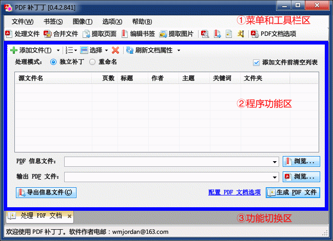

图表 4–1：PDF补丁丁的程序界面

界面主要分为上下两部分：上方是菜单和工具栏区，下方是程序功能区和功能切换区。

点击菜单项目或工具栏按钮，将打开相应的功能。

常用的功能在工具栏中显示为图标和功能文本，不太常用的功能则显示为图标。将鼠标移到工具栏的图标上，停留几秒钟，程序将弹出该按钮对应功能的说明文本。

打开了功能之后，在功能切换区将增加一个选项卡，与该功能相对应。

如不需要使用该功能了，可点击选项卡上的“X”按钮，将选项卡和对应的功能关闭。

下文逐一介绍程序各功能。

## 处理文件

处理PDF文件功能的界面如下图所示。

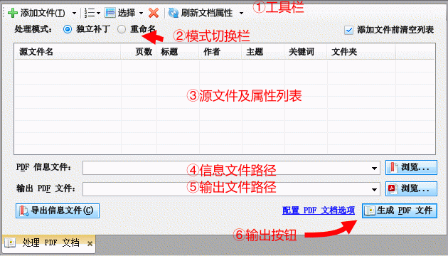

图表 4–2：处理PDF文件功能

### 文件列表

处于界面中央的是“源文件及文件属性列表”（上图③）。该列表列出需要处理的文件及其属性。按住键盘的Shift键或Ctrl键，再用鼠标点击文件列表的源文件名，可一次选中多个文件。

### 添加文件

使用工具栏（上图①）上的“添加文件”按钮可向文件列表添加需处理的文件。在“添加文件”按钮右方有一个小小的倒三角形按钮。点击该按钮将弹出一个菜单，列出最近处理过的PDF文件。点击菜单上的文件项，也可将文件添加到文件列表。

此外，还可在Windows资源管理器（或其它程序的文件列表框）中选中一批文件，然后用鼠标将文件项目拖放到列表上。

> **注意**
>
> 如选中了“添加文件前清空列表”复选框，则在添加文件之前会清空文件列表，再添加文件项。如果需要处理的文件要分几次才能添加到文件列表，请取消该复选框的选中状态。

> **说明**
>
> 添加文件时，如PDF文件本身被加密，并要求只有输入密码后才能打开，则会弹出一个输入身份验证的对话框以供输入密码。如不能提供正确的密码，将无法处理PDF文档。

### 调整文件的处理顺序

程序处理文件列表文件的顺序是从上到下。

选中文件后，用鼠标左键拖动选中的项目，可调整文件的处理顺序。

使用工具栏上的排序菜单可排序文件。排序方式有两种：“按数值和字母顺序排序”将文件名中的数字考虑为数值。“按字母顺序排序”则根据文件名的字母顺序排序。

例如，导入列表中有“1.tif”、“2.tif”、“10.tif”和“3.tif”等四个文件，按数字和字母顺序排序后，由于文件名中的“10”比“3”大，因此“10.tif”应排在“3.tif”后面，故排序后顺序为“1.tif”、“2.tif”、“3.tif”和“10.tif”；如按字母顺序排序，则“10.tif”中“1”出现在“2”和“3”之前，故排序后顺序为“1.tif”、“10.tif”、“2.tif”和“3.tif”。

点击文件列表的表头，也可按表头项对应的数据排序。点击第一次时执行顺序排序，再点一次则执行逆序排序。

### 删除文件项目

选中文件列表上的项目后，点击“×”按钮可删除选中的项目。

### 修改输出文件的属性

点击文件列表中文件项目的“标题”、“作者”、“主题”和“关键词”列，列表项将进入编辑状态。编辑项目的文本，可修改输出文件的属性（原始文件的属性不会更改）。如下图所示。

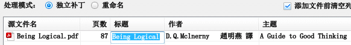

图表 4–3：修改输出文件的属性

某些PDF文件的文件属性没有使用正确的编码，文件属性将显示为乱码。在这种情况下，可以在文件列表中选中该PDF文件，然后点击工具栏上“刷新文档属性”按钮右边的倒三角按钮，在弹出的菜单中选择其它编码。如下图所示。

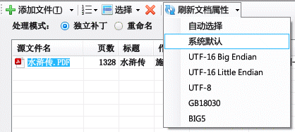

图表 4–4：使用其它编码方式解码文档属性

常用的编码有多种，逐一尝试，可能会选择到正确的编码方式，将乱码变成可读的文本。

### 切换补丁和重命名模式

在工具栏下的是“模式切换栏”（上图②），该栏包含两个单选框，对应两种处理方式。通过切换处理方式，可完成如下任务（详见下文）：

[独立补丁](#“独立补丁”处理模式)：修改PDF文档的内容（修改书签、页面链接、解除复制限制等）生成新的文件；

[重命名](#_重命名处理模式)：查看PDF文档属性并根据文档属性重命名PDF文件。

### 输出文件、信息文件路径及执行按钮

“生成PDF文件”按钮将执行模式栏选定方式对应的任务，生成新的PDF文件，输出到“输出PDF文件”（上图⑤）对应的文件路径。某些功能可能涉及用于修改PDF文档的信息文件。可在“PDF信息文件”（上图④）处指定。

下文将根据上述两种处理方式分别介绍其使用方法。

## “独立补丁”处理模式

处理文件功能的“独立补丁”模式用于修改处理列表的每个PDF文件。

### 补丁修改文档的操作步骤

独立补丁模式通常的操作步骤如下：

1. 选择“处理PDF文档”的“独立补丁”处理方式。

2. 使用“添加”按钮或拖文件方式向文件列表添加需要处理的PDF文件。

3. 点击界面右上角的“[配置处理文件选项](#高级补丁功能导出导入信息文件)”连接（或选择功能目录树中的“PDF文档选项”），在该界面[指定PDF文件需要更改的设置](#_导入信息选项)（如指定阅读器界面，去除复制和打印等限制，将书签状态设置为关闭，禁止书签和页面链接改变显示比例等等）。修改的设置将应用于生成的PDF文件。详见4.5节介绍。

4. 关闭选项对话框，返回“处理/制作PDF文件”功能，指定输出PDF文件的路径（可在文本框中插入包含替代符的输出文件名，替代符的使用方式详见4.3.2节）。

5. 点击“生成PDF文件”按钮。程序将逐一按“PDF文档选项”的设置处理文件列表中的PDF文件，并生成对应的新PDF文件到输出位置。

### 批量操作输出文件命名规则

为了正确操作多个原始文件的批量补丁操作，有必要了解批量操作后文件输出的位置及命名规则。程序有两种命名规则：默认命名规则和替代符命名规则。

#### 默认命名规则

在文件列表的文件有多个的情况下，输出文件名为“输出PDF文件”指定文件名所在的目录名+原始文件名+“.pdf”后缀。

例如：设选中的原始PDF文件处于“M:\\abc”文件夹下，有“f1.pdf”和“f2.pdf”两个。“输出PDF文件”对应的目录为“E:\\efg”，文件名为“xyz.pdf”（即路径为“E:\\efg\\xyz.pdf”）。

在批量操作中，程序将忽略输出路径的文件名部分，输出文件到“E:\\efg”目录，文件名为“f1.pdf”和“f2.pdf”。如下表及示意图所示。

表格 4–1：批量操作输出文件名示例

| 输入文件名           | “输出PDF文件”位置      | 实际输出文件名         |
| --------------- | ---------------- | --------------- |
| M:\\abc\\f1.pdf | E:\\efg\\xyz.pdf | E:\\efg\\f1.pdf |
| M:\\abc\\f2.pdf | 同上               | E:\\efg\\f2.pdf |

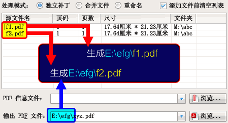

图表 4–5：默认命名规则输出的文件

#### 替代符命名规则

在“输出PDF文件”组合编辑框中，点击鼠标右键，将弹出一个上下文菜单。点击菜单的项目可插入替代符。在输出文件时，文件名的替代符将被替换成相应的内容。插入替代符的操作界面如下图所示。

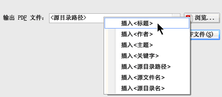

图表 4–6：在输出路径中插入替代符

各替代符的含义如下表所示。

表格 4–2：替代符含义

| 替代符名称     | 替代内容                                                                    |
| --------- | ----------------------------------------------------------------------- |
| \<标题\>    | 原始文档的“标题”属性                                                             |
| \<作者\>    | 原始文档的“作者”属性                                                             |
| \<主题\>    | 原始文档的“主题”属性                                                             |
| \<关键字\>   | 原始文档的“关键字”属性                                                            |
| \<源目录路径\> | 原始PDF文件路径除文件名的部分（设源文件的路径为“M:\\abc\\efg\\hi.pdf”，则替代符表示“M:\\abc\\efg\\”） |
| \<源文件名\>  | 原始PDF文件路径文件名不含扩展名的部分（设源文件的路径为“M:\\abc\\efg\\hi.pdf”，则替代符表示“hi”）         |
| \<源目录名\>  | 原始PDF文件路径的文件夹名称（设源文件的路径为“M:\\abc\\efg\\hi.pdf”，则替代符表示“efg”）             |

提示：源文件的属性已在文件列表中列出。

举例说明如下：

设选中的原始PDF文件有“M:\\abc\\efg\\f1.pdf”和“M:\\abc\\efg\\f2.pdf”两个。

其中“f1.pdf”文件具有以下文档属性：“标题”为“示例1”，“作者”为“W.
Jordan”，“关键词”为“示例文档”。

“f2.pdf”文件不具有文档属性。

输出路径为“\<源目录路径\>\<标题\>”，“\<源目录路径\>”表示原始PDF文件除文件名以外的路径部分。“\<标题\>”表示文档的“标题”属性。

由于“f2.pdf”文档不包含“标题”属性，因此，替代符替代的结果导致文件名为空。在这种场合下，程序将自动使用原路径的文件名作为输出的文件名部分。

输出情况如下表所示。

表格 4–3：输出路径包含替代符“\<源目录路径\>\<标题\>”时的输出文件名

| 输入文件名                | 文档属性                               | 输出文件名                 |
| -------------------- | ---------------------------------- | --------------------- |
| M:\\abc\\efg\\f1.pdf | 标题="示例1" 作者="W. Jordan" 关键词="示例文档" | M:\\abc\\efg\\示例1.pdf |
| M:\\abc\\efg\\f2.pdf | 无文档属性                              | M:\\abc\\efg\\f2.pdf  |

注意：本示例中，“f2.pdf”文件输出路径和原始路径相同，因此无法执行补丁。

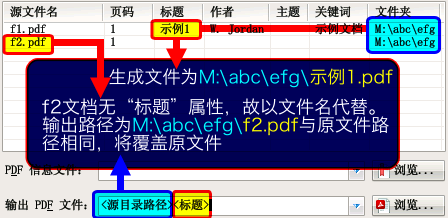

图表 4–7：替代符命名规则输出的文件

## 高级补丁功能（导出、导入信息文件）

高级补丁功能用于将PDF文档的信息导出成一个可编辑的文档。该文档包含PDF文档属性、书签、页面链接、页面尺寸等信息，称为“信息文件”。

补丁操作分两步进行：

第一步，导出信息文件：将PDF文档中的信息导出成可编辑修改的XML信息文件。

第二步，导入信息文件：使用文本编辑器修改上一步骤导出XML文件，然后在处理PDF文件处指定信息文件，点击“生成PDF文件”按钮，将源PDF文件和信息文件合并，生成一个具有修改后的设置的新PDF文件。

### 导出信息文件

操作步骤如下所示。

1. 选择“处理PDF文档”的“独立补丁”处理方式。

2. 向文件列表添加需导出信息的PDF文件。

3. 点击“PDF信息文件”右方的“浏览”按钮，指定保存导出信息文件的位置。

4. 点击“导出信息文件”按钮，程序将会把原始PDF文件中的信息导出到“PDF信息文件”对应的位置。

操作步骤如下图所示：

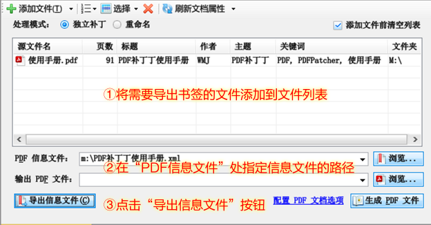

图表 4–8：导出信息文件的过程

### 关于“信息文件”

信息文件有两种类型：一种是XML格式的信息文件（文件名后缀为“xml”），另一种是简易文本文件（文件名后缀为“txt”）。

在导出信息文件时，信息文件的类型由文件名后缀确定。例如，信息文件名为“文件.xml”，则导出XML格式的信息文件；信息文件名为“文件.txt”，则导出简易文本书签文件。

XML信息文件包含的信息较全，较丰富。其可包含的信息有文档属性、阅读器设定、书签、页面链接、页面布局设置等。请参见第6章的介绍。

文本书签文件只包含文档属性和指向页面的书签信息（详见第7章），信息量远少于XML信息文件。如将PDF文档的书签导出成简易文本书签文件，编辑后重新导入到文档，由于简易文本书签包含的信息量较少，可能导致原文档的书签丢失一些信息（如无法精确定位到页面的指定位置等）。因此，一般场合下不要导出简易文本书签文件。

### 导入信息文件

在上一个步骤导出了信息文件后，可用文本编辑器或XML编辑器打开，修改里面的信息。修改后，可将信息文件的内容与原始PDF文件合并，生成一个新的PDF文件。操作步骤如下所示。

1. 按上一步骤的操作，指定PDF源文件和信息文件。

2. 点击“输出PDF文件”右边的“浏览”按钮，指定保存补丁后PDF文件的位置；或者可直接在输出PDF文件对应的组合框中输入输出文件路径。

3. 点击“生成PDF文件”按钮。程序将切换到输出信息界面。如导入成功，则输出的PDF文件将包含原始PDF文件的内容，以及PDF信息文件所附带的信息。

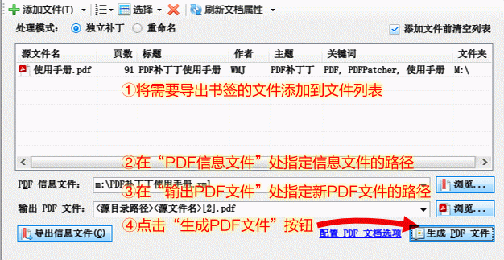

图表 4–9：导入信息文件的过程

信息文件的内容不一定需要全部导入PDF文件，可在“信息文件选项”功能的“导入选项”处指定应导入信息文件的哪些内容。

关于信息文件的详细使用方法，请参阅应用示例和[信息文件参考](#_信息文件参考)。

### 批量处理方式

如选定的原始PDF文件有多个，则导出信息文件时将导出到“PDF信息文件”组合框指定的目录，而信息文件名则按PDF文件名来命名。

例如：选中的原始PDF文件处于“M:\\abc”文件夹下，有“f1.pdf”和“f2.pdf”两个。点击“PDF信息文件”右边的“浏览”按钮后，指定信息文件放在“M:\\efg”目录，文件名为“xyz.xml”（即路径为“M:\\efg\\xyz.xml”）。程序在批量操作中将忽略输出路径的文件名部分，故实际输出的信息文件将放在“M:\\efg”目录，文件名为“f1.xml”和“f2.xml”。

表格 4–4：批量导出信息文件的输出文件名示例

| 输入文件名           | “PDF信息文件”位置      | 实际输出信息文件名       |
| --------------- | ---------------- | --------------- |
| M:\\abc\\f1.pdf | M:\\efg\\xyz.xml | M:\\efg\\f1.xml |
| M:\\abc\\f2.pdf |                  | M:\\efg\\f2.xml |

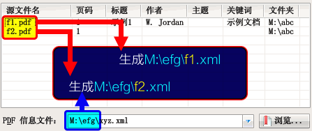

图表 4–10：批量导出书签的命名规则

导入文件时，信息文件的命名规则同上，即程序读取“PDF信息文件”所在目录中与PDF文件相同文件名的信息文件作为批量处理时的信息文件。

输出文件的命名，则按4.3.2节所述的方式确定。

### 信息文件选项

信息文件选项用于指定高级补丁两个步骤中导出、导入的内容。选择程序“选项”菜单中的“信息文件选项”命令，将弹出信息文件选项对话框。

#### 常规导出选项

常规导出选项指定导出信息文件功能导出的内容。界面如下所示。

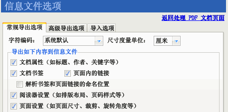

图表 4–11：信息文件选项（常规导出选项）

各选项说明如下。

字符编码：指定使用何种编码导出信息文件。系统默认编码为GBK。某些PDF文件包含一些无法用GBK编码来表示的字符。这时可尝试选择该下拉框的“GB18030”、“UTF-8”或“UTF-16”等编码方式（使用系统默认、UTF-8或UTF-16编码方式导出的信息文件可用Windows记事本直接打开编辑）。

文档属性：指定是否导出PDF文档的标题、作者、关键字、主题等元数据信息。

文档书签：指定是否导出PDF文档内的书签信息。当需要修改PDF书签时，可选中此选项。

页面内的链接：指定是否导出PDF文档页面内的链接。对于某些PDF文档，点击其中某些区域可跳转到文档的其它位置，打开新的文档或打开网站等，当需要修改这些链接时可选择此选项。

解析书签和页面链接的命名位置：PDF文档中的“命名位置”是一个用特定名称表示的跳转目标，与书签信息是独立存储的。如发现导出的PDF书签或页面链接无法补丁到PDF文档，可尝试选中此选项，将书签和页面链接的命名位置转换为实际位置。

阅读器设置：指定是否导出初始排版方式（如单页、单页连续、双页等）、页码样式（在PDF阅读器中看到的逻辑页码编号方式，如“I”、“II”、“III”形式的罗马数字页码，“A”、“B”、“C”形式的英文字母顺序页码）等设置。

尺寸度量单位：指定使用何种单位表达PDF文档坐标值。程序中默认为“厘米”。

提示：PDF文档中使用的标准度量单位是“点”。如需精确导出定位信息，请选择“点”为度量单位。

#### 高级导出选项

高级导出选项是PDF补丁丁为PDF开发人员提供的高级功能。该功能可以XML表示形式导出PDF页面的内容、处理指令等信息，供开发参考。界面如下所示。

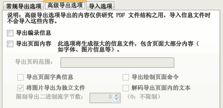

图表 4–12：信息文件选项（高级导出选项）

导出编录信息：选中该复选框后，导出的信息文件将包含PDF编录（Catalog）字典中的内容。

导出页面内容：选中该复选框后，导出的信息文件将包含PDF页面的字典、绘制指令等内容，供调试、研究文档之用。

页码范围：指定仅导出部分页面的内容。如不指定页码范围，则导出所有页面的内容。

选中“导出页面字典信息”复选框，可导出页面的字典信息。

选中“导出绘制页面命令”复选框，可导出向页面输出文本、图片和图像等内容的指令。

选中“将图片导出为独立文件”复选框，可把图片保存为独立的文件，而不写入到XML信息文件。

选中“解码导出页面内的文本”复选框，可把文档页面内容流的文本解码提取出来。

如仅需要分析二进制流前面若干字节的内容，可在“限制导出二进制流字节数”的数字调整框中输入数值，如“100”，表示仅导出二进制流前面100个字节的内容。

说明：高级导出选项导出的XML内容仅供参考，不会在导入时写入PDF文档。PDF文档中的二进制内容将使用HexBin编码方式编码成XML文档中的CDATA字符串。

#### 导入选项

导入选项用于指定高级补丁功能中导入的内容，其界面及各选项含义如下。

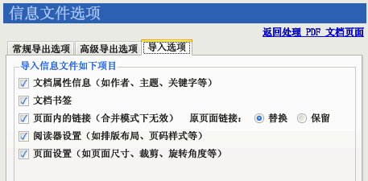

图表 4–13：PDF文档选项（信息文件内容）

文档属性信息：是否使用信息文件中指定的元数据（如作者、主题、关键字等）。

文档书签：是否使用信息文件中指定的书签。如不选中此选项，则输出文件的书签与原始PDF文件的相同。书签格式可参考信息文件参考中[书签](#_书签)一节的说明。

页面内的链接：是否导入信息文件中包含的页面链接。如选择此选项，则可用信息文件中的页面链接替换（选择“原页面链接”右方的“替换”单选框）或叠加（选择“保留”单选框）原始PDF文件的页面链接。

阅读器设置：是否导入阅读器的初始状态（如是否在打开文档时显示书签、全屏显示、初始页面状态）和页码编号方式。

页面设置：是否导入各页面的尺寸、裁剪边框、旋转角度等数据。

## PDF文档选项

PDF文档选项用于指定如何修改PDF文档。点击工具栏上的“PDF文档选项”项目，将打开PDF文档选项对话框。

选项对话框以选项卡形式划分选项。界面分“页面尺寸”、“阅读方式”、“压缩清理”、“文档属性”、“页码标签”和“替换字体”等选项卡，分别介绍如下。

### 页面尺寸

该选项可统一PDF文档的尺寸，或调整页面边框的留白，其界面及各选项含义如下。

说明：选项卡的默认状态如下图所示。如更改了界面的设置，导入信息时以界面上的设置为准；如保留默认设置，则以信息文件指定的信息为准。

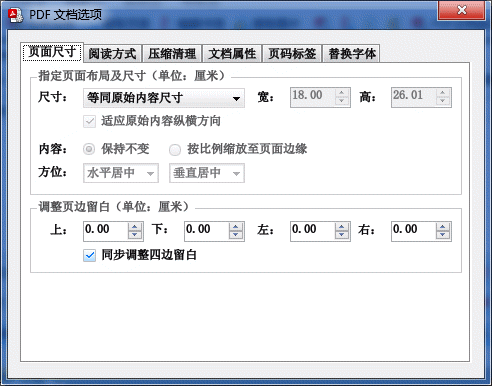

图表 4–14：PDF文档选项（页面尺寸）

页面尺寸、宽、高：在此列表可指定输出PDF文件的页面尺寸。更改“页面尺寸”列表的选中项目后，具体尺寸将在“宽”和“高”对应的文本框中显示。最终的页面尺寸以“宽”和“高”指定的尺寸为准。即使源PDF文件页面尺寸不同，输出后的页面均将统一尺寸。

特殊页面尺寸：

“等同原始内容尺寸”：不改变输出的PDF文档的页面尺寸。

“固定页宽自动高度”：自由指定输出PDF文档页面宽度，将源PDF页面等比例缩放到指定的宽度。

位置：指定源PDF页面在新尺寸页面上的对齐方式。

页面留白：在页面四边留下的空白。选中“同步调整四边留白”选项时，更改任一个留白数值会改变其余三个的值。取消选中该选项框，可单独调整各边留白数值。数值可以为负数，用于减少页面留白。

### 阅读方式

阅读方式选项卡用于指定阅读器的界面设置，其界面及各选项含义如下。

说明：选项卡的默认状态如下图所示。如更改了界面的设置，导入信息时以界面上的设置为准；如保留默认设置，则以信息文件指定的信息为准。

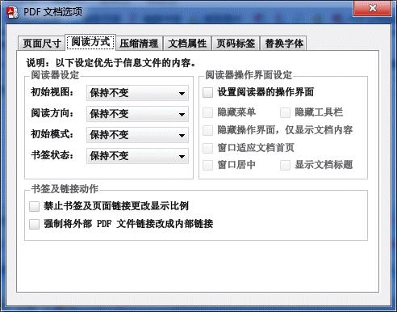

图表 4–15：PDF文档选项（阅读方式）

阅读器设定：指定阅读器的初始视图、阅读方向和初始模式。下拉列表中选择“保持不变”时，以信息文件或原始PDF文件中指定的设定为准。

在一屏显示两页竖排文本（如某些古籍）的场合下，可设置文档的阅读方向为“从右到左”，以适应竖排阅读方式。

“书签状态”选项用于指定是否打开（展开）或关闭所有书签。不指定状态时，以信息文件或原始PDF文件中指定的状态为准。

书签及链接动作：指定书签及页面内链接的缩放比例。有些书签或页面链接在点击后会改变阅读器当前的显示比例，选中“禁止书签及页面链接更改显示比例”复选框，可去除此类行为，使点击书签及页面链接后仍保持阅读器的显示比例。有些PDF文档，更改文件名后书签失效，选中“强制将外部PDF文件链接改成内部链接”选项，可修复此类书签。

阅读器操作界面设定：指定在PDF阅读器中打开PDF文件时的界面。默认状态下，不强制更改PDF阅读器的界面设置。如需重写PDF文档的操作界面设定，可选中“指定操作界面设置”复选框。选中该复选框后，下面灰色被禁用的复选框将变成可操作的状态。通过设置这些复选框的选中状态，可指定打开文档后PDF阅读器的界面。

### 压缩清理

此功能用于提高PDF文档的压缩率，并可清理一些不需要的内容。其界面及选项内容如下。

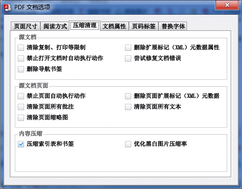

图表 4–16：PDF文档选项（压缩清理）

源文档处理、源文档页面处理：用于清除限制（如复制、打印等限制）、自动执行的动作、文档批注及元数据信息。

说明：关于扩展标记（XML）元数据属性：XML元数据属性是一种附加在文档上的标注信息，一般不影响阅读，如无需要可将其删除。

尝试修复文档错误：一般场合下没有必要选择此复选框。若打开某些PDF文档时出现“操作符无效”错误，可选中此复选框尝试修复文档内容。

清楚页面所有文本：一般场合下不要选择此复选框。该选项将清除页面上所有的文本内容。

压缩索引表和书签：选中此选项时，程序将压缩PDF的索引表和书签等数据，尽最大限度减少PDF文件占用的空间。

注意：低版本或不兼容的PDF阅读器可能无法打开压缩索引表的PDF文档。

优化压缩黑白图片：选中此选项时，程序将尝试使用JBIG2算法压缩PDF文档内的黑白图片，以求减少图片所占用的文件空间。如果压缩后无法减少文件大小，将保持原图片不变。选择此选项不会降低图像质量，但可能会使用更多的处理时间。

### 文档属性

文档属性选项卡用于指定文档属性。一般场合下不需要使用此选项卡设置文档属性，在文档列表中直接输入需要设置的文档属性即可。此选项卡是用于批量设置文档属性的。其界面及各选项含义如下。

说明：选项卡的默认状态如下图所示。如更改了界面的设置，导入信息时以界面上的设置为准；如保留默认设置，则以信息文件指定的信息为准。

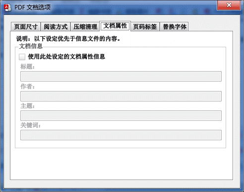

图表 4–17：PDF文档选项（文档属性）

文档信息：选中“使用此处设定的文档属性信息”复选框后，可指定文档标题、作者、主题、关键词等属性。

在“独立补丁”处理模式下，可用鼠标右键点击各文档属性文本框，弹出插入“\<源文件名\>”和“\<源目录名\>”替代符的菜单命令。“\<源文件名\>”表示使用源PDF文件的文件名作为指定的文档属性，“\<源目录名\>”表示使用目录名称作为指定的属性。使用此功能可使用PDF文件名或目录名轻松修改PDF文件的属性。

重写文档属性时，如设定的文档属性为空，则保留PDF文档相应的原始属性。如属性为一个或多个半角空格（“
”），则删除PDF文档对应的原始属性。

### 页码标签

PDF文档的页码标签通常在PDF阅读器的翻页控件上显示，表示文档中的逻辑页码。

页码标签选项卡可用于指定逻辑页码标签，其界面及各选项含义如下。

说明：选项卡的默认状态如下图所示。如更改了界面的设置，导入信息时以界面上的设置为准；如保留默认设置，则以信息文件指定的信息为准。

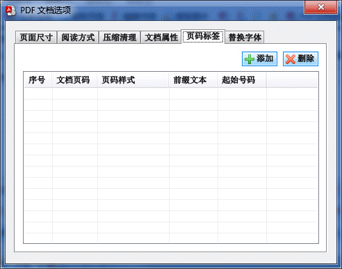

图表 4–18：PDF文档选项（页码标签）

点击“添加”按钮可新增一个页码标签。如需修改页码标签，可直接点击列表框相应的页码标签项修改其内容。点击“删除”按钮可删除选中的页码标签。

文档页码：表示文档中使用此页码标签的实际页码。在PDF阅读器界面上，从该页开始，后面的页面将使用设置的标签显示页码。

页码样式：页码编号的样式。默认为数字，此外可使用罗马数字及英文字母。

前缀文本：在逻辑页码标签前的文本。

起始号码：逻辑页码标签开始编号的号码，一般保持为1。

现以下图为例，说明页码标签的用法。


图表 4–19：页码标签设置示例

在上图中，第一项的文档页码为1，页码样式为“大写英文字母”，前缀文本为“封面”，起始页码为“1”，则在阅读器中第1页的页码显示为“封面A”。

第二项的文档页码为2，页码样式为“大写罗马数字”，前缀文本为“目录-”，起始页码为“1”，则在阅读器中从第2页开始，到第8页为止（共7页），页码显示为“目录-I”、“目录-II”、“目录-III”……“目录-VII”。

第三项的文档页码为9，页码样式为“数字”，前缀文本为空，起始页码为1，则在阅读器中从第9页开始到文档最后一页，页码显示为“1”、“2”、“3”……

### 替换字体

替换字体选项卡的设置内容用于将PDF文档的字体更换为系统中安装的其它字体。对于某些没有嵌入字体的PDF文档，此功能还可实现嵌入字体的功能。其界面及各选项含义如下。

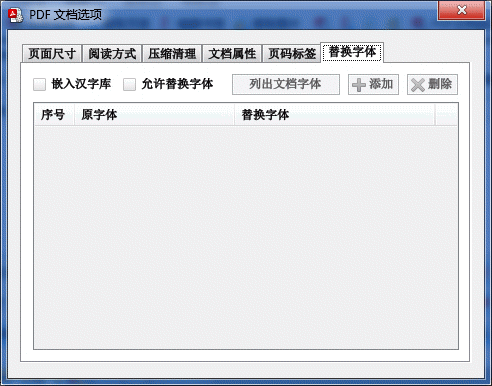

图表 4–20：PDF文档选项（替换字体）

嵌入汉字库：选中此选项后，为没有嵌入字库的PDF文档自动嵌入如下常见字库：宋体、黑体、楷体、仿宋体、幼圆体。

允许替换字体：选中此选项后，可替换PDF文档中的字体。

列出文档字体：要替换PDF文档中的字体，首先需要知道文档中采用了哪些字体。点击此按钮，将出现一个对话框。如下图所示。

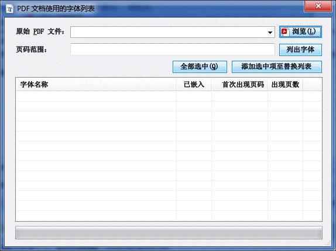

图表 4–21：列出文档字体

点击“浏览”按钮，选择需列出字体的PDF文档，再点击“列出字体”按钮，该文档中使用到的字体将列出到对话框下方的列表。

选中字体名称对应的复选框，再点击“添加选中项至替换列表”按钮，选中的字体就会被添加到PDF文档选项的替换字体列表。点击列表项目右方“替换字体”列，指定系统中安装的字体。

执行补丁操作后，“原字体”列的字体就会被替换为“替换字体”列的字体了。

## 重命名处理模式

此功能用于查看PDF文档的属性，并可根据文档属性更改PDF文件名。

操作方式与独立补丁处理模式类似。

输出PDF文件用于更改PDF文件的命名模板。命名模板支持替换符，因此可用文档属性（如“标题”重命名PDF文件）。关于替换符的用法请参见替代符命名规则一节的介绍。

点击“测试”按钮可预览重命名结果。

点击“生成PDF文件”按钮，将按重命名模板更改源PDF文件名称为模板指定的名称。如选中“保留原始文件”复选框，则保留重命名之前的PDF文件，否则文件会被改为新的名称。

## 合并文件

此功能可实现多种方式制作PDF文件的功能，例如制作扫描书籍的电子书、将整个目录的图片和PDF文件合并为一个PDF文件等。

合并功能还可在已有的PDF文件中抽取指定范围的页面，导出到生成的PDF文件，即具有合并或拆分PDF文件。

在界面正中有一个列表框，称为“文件列表”。在文件列表，可混合指定图片和PDF文件，将图片插入到PDF文件的页面中。

双击列表中的源PDF文件，可以指定该文档中参与合并操作的页码范围。页码范围默认为第一页到最后一页，通过修改页码范围，可实现拆分、重排PDF文件页面的功能。

此外，可通过修改[合并文档选项](#合并文档选项)的设置，在合并PDF文件时指定输出PDF文件的属性。

本功能的界面如下图所示。

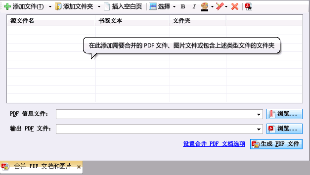

图表 4–22：合并文档功能

### 操作方法

使用合并文件功能生成PDF文档的操作步骤如下。

1. 点击工具栏上的“合并文件”按钮。

2. 向文件列表添加图片（JPEG、PNG、GIF、BMP和TIFF文件）或源PDF文件。每个图片将成为PDF文档的一页，如有3个图片，则PDF文档有3页；10个图片则文档有10页。如果图片文件有多帧，则每帧将作为单独的一页。

3. 如需添加空白页，可点击工具栏的“插入空白页”按钮。

4. 点击“添加文件夹”按钮，将弹出一个打开文件的对话框。使用该对话框定位到需要添加的文件夹，点击“打开”按钮，可以将该文件夹中所有的图片或PDF文件添加到列表（含子文件夹的文件）。

5. 如果添加了不需要合并的文件或文件夹，可以选中该项目，然后点击工具栏上的“删除文件”按钮将该文件或文件夹从文件列表中删除。

6. 如需为生成的PDF文件挂上书签，可点击“PDF信息文件”右边的“浏览”按钮，指定书签文件的位置。信息文件不是必需的，可不指定。不指定书签时，程序根据文件列表中“书签文本”列为生成的PDF文件生成书签。

7. 点击“输出PDF文件”右边的“浏览”按钮，指定制作PDF文件的保存位置。

8. 点击“生成PDF文件”按钮。

9. 程序将创建PDF文件，然后按文件列表的顺序逐一将图片或源PDF文件添加到输出PDF文件的页面。

   提示：除了使用添加文件或文件夹的按钮之外，还可以直接从资源管理器将文件拖放到文件列表。

#### 排序文件

选中文件项目后，用鼠标点住需要移动文件的文本区域，然后拖动鼠标，就可以移动文件。将鼠标移到其它文件项上面，释放鼠标按键，就可使选中的文件移到对应的位置。

例如，在下图中选中“程序主界面.PNG”和“子文件夹2”两个文件项后，用鼠标将其拖动到“文件夹1”书签上。在“文件夹1”上将显示一个蓝色的矩形。

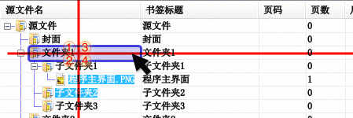

图表 4–23：排序文件项目

蓝色的矩形有四个区域，在不同区域释放鼠标按键有不同移动方式。以上图为例。

在①区域上释放鼠标按键，选中的文件项目将移动到“文件夹1”的前面。

在②区域上释放鼠标按键，选中的文件项目将移动到“文件夹1”的后面。

在③区域上释放鼠标按键，选中的文件项目将移动到“文件夹1”的所有子项的前面。

在④区域上释放鼠标按键，选中的文件项目将移动到“文件夹1”的所有子项的后面。

移动文件项目后的效果分别如下图各标记所示（被移动的两个文件项目为选中状态）。

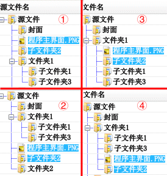

图表 4–24：移动文件项的效果

说明：在拖动书签时，按键盘的Esc键可取消拖动操作。

#### 设置书签文本和书签样式

合并生成PDF文件时可指定导航书签，在阅读器中点击书签将跳转到与文件对应的页面。

书签文本在合并文件列表的“书签文本”列设置。将文件添加到合并文件列表后，点击“书签文本”列的单元格。该单元格将进入编辑状态，在其中输入文本，即可为文件设置对应的书签项。

在书签文本不为空的情况下，选中文件项，再点击工具栏上的“B”和“I”按钮，可分别为书签项设置粗体和斜体样式；点击工具栏上调色板按钮旁边的倒三角形小按钮，可设置书签项的文本颜色。

如果书签文本内容为空，则该项目不生成书签。如果该项有子项，且子项文本不为空，则子项仍生成对应的书签。

说明：在添加文件到合并文件列表时，程序自动根据文件名设置其对应的书签文本。此行为可在合并文件选项中调整。

#### 裁剪源图片选项

双击文件列表的图片文件，将弹出“源图片处理选项”对话框，如下图所示。使用该对话框可指定在导入图片制作PDF文件时，先裁剪图片，再导入到文档。

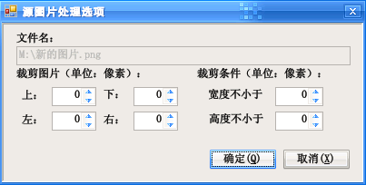

图表 4–25：源图片处理选项对话框

#### 筛选源PDF文件页面选项

双击文件列表的PDF文件，将弹出“源PDF文件选项”对话框，如下图所示。使用该对话框可指定仅导入源PDF文档的若干页面，或仅导入PDF文档内的图片。

导入及处理源PDF文件图片方式栏中的控件默认状态为禁用。只有选中“仅导入源PDF文件的图片”复选框后才可用。导入图片选项与[提取图片](#全局选项)功能的选项类似，请参见该章节的说明。

提示：页码范围支持逆序范围，如页码范围“10-1”，将先插入源文件的第10页，再插入第9页，以此类推，最后插入第1页到输出文档。

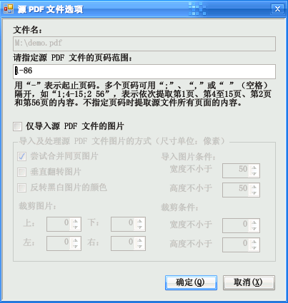

图表 4–26：源PDF文件选项对话框

### 已知问题

- 导入书签的尺寸要符合所选输出文件的尺寸，否则定位坐标可能不准确。

- 源PDF文件的文档属性及元数据不会输出到生成的目标文件，但可通过指定信息文件的方式将其导入到输出文件，或在“PDF文档选项”指定文档信息。

## 合并文档选项

合并文档选项用于指定合并功能生成的PDF文档的选项。点击工具栏上的“合并文档选项”项目，或点击界面上的“设置合并PDF文档选项”链接，将打开“合并文档选项”对话框。

选项对话框以选项卡形式划分选项。界面分“页面布局”、“阅读方式”、“书签”、“文档杂项”和“页码标签”等选项卡。其中，“阅读方式”、“文档杂项”和“页码标签”的内容和功能与PDF文档选项基本一致，在此不在赘述。下文将介绍“页面布局”和“书签”两个选项卡。

### 页面布局

“页面布局”选项卡界面如下图所示，该界面类似于PDF文档选项的“页面尺寸”对话框，但增加了如下选项。

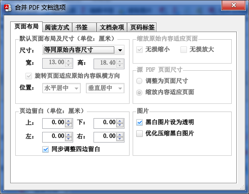

自动旋转页面适应原始内容纵横方向：选中此选项时，如图片纵横方向与页面不同，并且页面无法容纳图片时，程序将自动旋转页面以更好地适应图片。

例如，点击“尺寸”下拉列表，选择页面尺寸为16开页面（宽184毫米、高260毫米），是宽度小于高度的纵向页面。这时输入的源页面尺寸为1024像素宽、768像素高，该图片为宽度大于高度的横向页面。如不选中本选项，则横向的图片直接放到纵向的页面上，会留下很多空白（下图左）

选中本选项后，程序将自动把页面布局设为横向，适应源图片的方向，再将源图片的内容放到新页面上（下图右）。


缩放原始内容适应页面：指定是否调整源图片尺寸以适合页面尺寸。选中“无损缩小”复选框，当页面小于原始内容尺寸时，将原始内容缩小到适合页面。选中“无损放大”复选框，则当原始内容小于页面尺寸时，将其放大到适合页面。

提示：调整缩放比例不会降低图片的质量（该操作仅用PDF内置缩放命令使图片呈现不同的尺寸）。

源PDF页面调整：指定是否改变源PDF文件的页面放大比例，使之适合输出文档页面的尺寸。默认选中“调整为页面尺寸”，程序保持文档原内容不动，但更改页面尺寸，使之与页面设置的尺寸保持一致。这样可以扩大页面空白面积以便添加批注，或隐藏页面上不必要的空白方便阅读。如选中“缩放内容适应页面”，从源PDF文件导入的页面将拉伸到适合输出文档页面的尺寸。

黑白图片设为透明：对于只有黑白两色的图片，将其设置为透明（在PDF阅读器中将不可选中并复制该图片）。

优化压缩黑白图片：使用压缩率较高的JBIG2算法压缩黑白图片。

### 书签

书签选项卡包含控制PDF文件生成书签的选项，其界面如下。

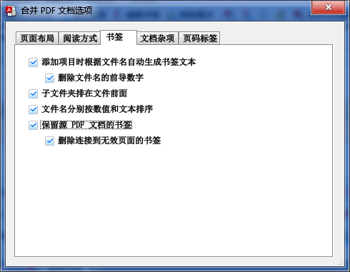

图表 4–27：PDF文档选项（书签）

添加项目时根据文件名自动生成书签文本：选中此项时，为每个源文件（图片或源PDF文件）对应的页面添加一个书签项，书签项的文本为源文件名（删除扩展名部分）。

忽略文件名的前导数字：在选中“添加项目时根据文件名自动生成书签文本”复选框时，此选项有效。选中此项时，书签项的文本为源文件名删除前面的数字后的部分。如删除数字后文件名为空，则不为该页添加书签。例如，用于生成PDF的文件列表有4个图像文件，其文件名分别为：“0001封面.jpg”、“0002目录.tif”、“0003.tif”和“0004第一章.tif”，则生成的书签有三项，名称为“封面”（跳转到第1页）、“目录”（跳转到第2页）和“第一章”（跳转到第4页）。

子文件夹排在文件前面：选中此选项时，在添加文件夹到文件列表时，文件夹包含的子文件将排在文件前面。不选中此选项时，按照文件的字母顺序排序文件。

文件名分别按数值和文本排序：选中此选项时，在添加文件夹到文件列表时，文件夹包含的文件将分别按数值和文本排序，例如以下序列是按数值和文本排序1.pdf、2.pdf和10.pdf（排序时将“10”视为数值，排在“2”后面），而1.pdf、10.pdf和2.pdf是按文本排序（排序时将“10”视为文本，排在“2”前面）。

说明：更改上述各选项后，文件列表的书签文本不会刷新。如需刷新书签文本，可在文件列表删掉原来添加的文件，重新再向列表添加文件时，将按新的设置生成书签文本。

保留源PDF文件的书签：将源PDF文件的书签复制到合并后输出的文档。如源PDF文件的页面不在输出文档，则点击书签将不执行任何动作。

删除连接到无效页面的书签：在选中“保留源PDF文件的书签”复选框时此选项有效。选中此选项后，如源PDF文件的页面不在输出文档，则删除指向该页面的书签（如书签包含子书签，则子书签也将被删除）。例如源PDF文件有100页，仅将其中1～50页导入生成新的PDF文件，则源文件中指向原文档第51～100页的书签项将被删除。

## 自动生成书签

此功能可用于自动生成PDF文档的书签。其原理是：PDF文档的文本有一定的格式规律，因此可按照页面文本、尺寸、所用字体等规则，筛选出符合规则的文字（往往是大字标题），从而利用这些文本生成PDF书签。本功能的界面如下图所示。

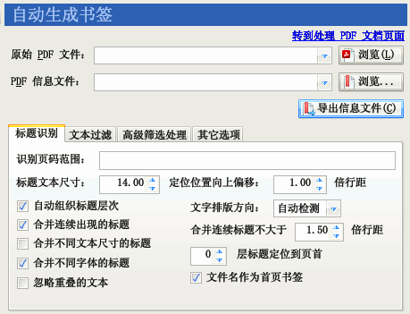

图表 4–28：自动生成书签功能

说明：此功能是通过分析PDF文档内文本内容的字体尺寸，从而为PDF文档自动创建书签的，并不是执行光学字符识别（OCR）将图片识别为文本。

### 操作步骤

使用此功能生成文本PDF的书签文件，操作步骤如下。

1. 选择“识别标题为书签”功能。

2. 点击“原始PDF文件”右边的“浏览”按钮，指定需要识别标题为书签的PDF文件。

3. 点击“PDF信息文件”右边的“浏览”按钮，指定保存识别后生成书签的信息文件。

4. 如有需要，可调整选项（特别是“识别页码范围”）。

5. 点击“导出信息文件”按钮。程序将分析识别原始PDF文件中指定页码范围页面内的文本，抽取尺寸大于“标题文本尺寸”微调框数值的文本，将其组织成书签，并保存为XML信息文件。在程序的处理过程中，日志窗口会输出识别为标题的文本、级别，及其所在页码。

6. 观察日志窗口的输出内容，可知输出书签的概貌。通常第一次分析得到的书签不太理想，可返回调整筛选选项，如调整标题文本尺寸以包含字体更小（或更大）的标题文本、指定过滤文本筛选不需要的文本、在高级筛选处理选项中添加筛选器剔除特定的字体等。

   提示：可用文本编辑器打开此功能输出的信息文件，里面列出了标题文本的尺寸。此外，可在“高级筛选处理”选项中，点击“从信息文件添加”按钮。点击该按钮后，程序弹出一个对话框。用该对话框可从输出信息文件添加标题文本筛选器。

7. 重复步骤5和6，直到获得比较满意的书签嵌套效果。

8. 完成后，转到“处理、生成PDF文档”功能的“独立补丁”处理模式，使用前述生成的信息文件补丁PDF文件，查看输出文件的书签效果。如效果不理想，可手工修改XML信息文件并重新补丁。

   提示：详细的应用示例可参考本手册第5.10节。

### 标题识别选项

在本功能的选项卡中可指定分析过程的筛选参数。

识别页码范围：指定需要分析文本的页码。

标题文本尺寸：指定只有尺寸大于此数值的文本才可能被抽取为书签。

定位位置向上偏移若干倍行距：当文本被抽取为书签项目后，点击书签项目将跳转到对应的文本，但会向上偏移一些位置，使定位后的文本不会贴到阅读器窗口顶端。

自动组织标题层次：选中此选项时，程序根据文本的尺寸级别生成多级书签。

合并连续出现的标题：如果两行文本都符合构成标题的条件，就将其视为一个标题（适应一个标题分两行显示的场合）。

合并同一行内不同尺寸的标题：当标题文本字体尺寸不一，可选中此选项，使尺寸不一的文本合并为一个标题。

合并不同字体的标题：当标题文本字体样式不一，可选中此选项，令使用不同字体的文本合并为一个标题。

忽略重叠的文本：某些PDF制作程序会在同一个位置略错开一点的位置多次输出相同的文本，从而制作出仿粗体或阴影的效果，这样将导致出现重复文本。选中此选项，可让程序检测该技术手段，忽略在同一个位置重复出现的文本。

文字排版方向：程序一般可自动检测文本的排版方向，但由于算法智能有限，可能推断错误，可使用此选项可人工指定文字的排版方向，提高程序组织文本布局的准确度。

合并连续标题不大于若干倍行距：在选中“合并连续出现的标题”后，小于此指定行距的标题将被合并为一个标题。

若干层标题定位到页首：默认情况下，点击识别后生成的书签将定位到书签所在的位置。选中此选项，则点击指定层数内的书签将定位到页面顶部，而不是书签所在的位置。

为首页生成书签：选中此选项后，将生成一个书签项指向文档第一页，该书签项的文本为PDF文件名，此外，无论是否有文本满足标题的条件，不再为首页生成书签。不选中该选项，则按照普通的规则处理。

### 文本过滤选项

文本过滤选项指定用于过滤文本的列表（每行一个）。匹配指定模式的文本将被忽略。界面如下。

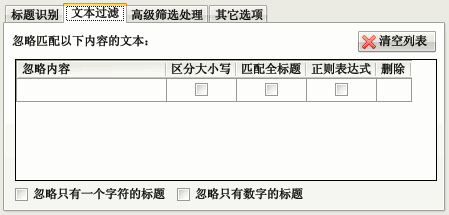

图表 4–29：自动生成书签功能的文本过滤选项

忽略只有一个字符的标题：有些PDF文档有首字下沉的大字，可用此选项将其忽略。避免下沉字被认作标题（选中此选项时，不要选择“合并同一行内不同尺寸的标题”选项，否则下沉字会和普通文本合并到一起）。

忽略只有数字的标题：此选项通常可用于忽略页码数字。

在“忽略内容”列填入需要忽略的标题文本。当PDF文本匹配忽略内容时，程序就不会将其当成书签标题。

选中“区分大小写”列的复选框，则匹配忽略内容时区分英文大小写。

选中“匹配全标题”列的复选框，则只有整行PDF文本和忽略内容长度一致时才会忽略该行文本。

选中“正则表达式”列的复选框，则忽略内容为正则表达式。

如果需要删除已输入的忽略内容模式，可点击“删除”列下对应的按钮或点击“清空列表”按钮。

### 高级筛选处理选项

高级筛选处理选项可指定在特定的条件下忽略文本或更改匹配文本的标题级别。界面如下。

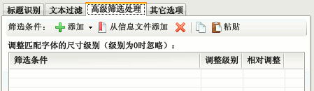

图表 4–30：自动生成书签功能的高级筛选处理选项

在上述界面可添加用于筛选标题文本的筛选条件。已添加的筛选条件在列表中列出，每行是一组筛选条件和匹配该条件后调整级别的值。如果某段文本符合特定组别的筛选条件，则执行调整级别动作。调整级别时，如筛选条件对应“相对调整”列的复选框被选中，则匹配筛选条件的文本级别将增加或降低“调整级别”列指定的数值，否则文本的级别将更改为“调整级别”列指定的数值。

提示：调整级别为0，且“相对调整”复选框未选中时，表示将过滤匹配条件匹配的文本。

如果调整后的数值小于“标题识别”选项中指定的“标题文本尺寸”参数，则该段文本就会被忽略，不会输出到生成的书签。如数值大于标题文本尺寸选项的值，则原来被该选项忽略的文本也可输出到生成的书签。

工具栏上有5个按钮：“添加”按钮用于手工添加筛选器，一般不使用该按钮，而是使用“从信息文件添加”按钮，从第一趟处理生成的信息文件中添加筛选器。“删除”按钮可删除列表内选中的筛选器。“复制”和“粘贴”按钮可用于复制和粘贴筛选器。

关于高级筛选处理选项的使用方法，请参阅[应用示例](#应用示例)一章的相关介绍。

### 其它选项

选中“完成识别后统计用于标题的字体”复选框，则识别后将在日志窗口列出用于标题的字体。

如选中“列出被忽略的字体”复选框，则在统计信息中还包含已被筛选条件忽略掉的字体名称。

如选中“导出文本位置信息”复选框，则导出的信息文件中还将包含文本在页面内的位置信息。

## 编辑书签文件

此功能可编辑[简易文本书签文件](#_简易书签文件参考)、[XML信息文件](#_信息文件参考)或直接提取PDF文档书签，并保存为信息文件或向已有PDF文档添加书签。本功能的界面如下图所示。

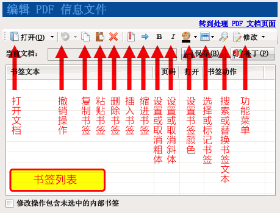

图表 4–31：PDF书签编辑器界面

界面上方是两排按钮，中间是以树型形式显示的书签列表。将鼠标移到工具栏的按钮上，停留片刻，将弹出提示信息，说明该按钮的用途，并显示键盘操作快捷键。第一排按钮按从左到右的顺序说明如下：

“打开”按钮打开需要编辑书签的信息文件或PDF文件。点击该按钮旁边的小三角形，将弹出一个菜单，上面列出了最近处理过的信息文件或PDF文件。点击菜单项，将打开对应文件的书签。

“撤销”按钮用于撤销前一步修改操作，恢复书签到修改前的状态。点击“撤销”按钮旁边的小三角形，将弹出一个菜单，点击菜单的项目可一次撤销多步操作。

“复制”按钮用于复制选中的书签。

“粘贴”按钮用于将之前复制的书签粘贴到指定位置。

“删除”按钮删除选中的书签。如果书签包含子书签，则子书签也会被删除。

“插入书签”按钮插入一个新的书签项到当前书签后面。

“缩进书签”按钮将选中的书签设置为上一个同级文档的子书签。

“粗体”、“斜体”按钮分别切换书签文本的粗体和斜体样式。

“颜色”按钮设置书签文本的颜色。点击其旁边的小三角形，将弹出一个取色框，可在上面选择预定义的颜色，或使用调色板选择所需颜色。

点击“选择或标记书签”按钮将弹出一个菜单，菜单包含如下命令：

全部选中：选中所有显示可见的书签。

全部不选：取消所有书签的选中状态。

反转选择状态：选中没有选择的书签，取消已选择书签的选中状态。

标记书签：将选定的书签标记为指定颜色，以便后续处理；或取消选中书签的标记状态。

选择已标记书签：选中使用“标记书签”功能标记的书签。

全部折叠：隐藏所有书签的子书签。

折叠子书签：隐藏当前选中书签的子书签。

全部展开：展开所有书签的子书签，使所有书签全部显示出来。

点击“搜索或替换书签文本”按钮将弹出一个对话框，可使用该对话框搜索或批量替换选中书签的文本。

点击“修改”菜单按钮将弹出一个菜单，上面列出多个常用的修改书签命令，点击命令将修改选中的书签。所有修改命令列出如下。

设置目标显示方式：设定点击书签后跳转到目标位置的显示方式。

设置书签默认打开状态：设置书签在阅读器中是否默认打开。此命令仅可用于包含子书签的书签。

清除书签目标定位偏移：清除横坐标偏移将禁止点击书签后更改阅读器的横向偏移位置；清除纵坐标偏移将使点击书签后跳转到该页面的顶端。

更改目标页码：修改点击书签后的目标页面页码。

更改书签文本大小写：设置书签文本的英文大小写形式。

更改目标页面坐标：更改点击书签后的目标页面坐标，可以设置绝对值或偏移修改值。

合并书签：将选中的书签合并为一个书签，保留最上方一个书签的属性，所有选中书签文本串联起来作为该书签的文本。

强制设置为文件内链接：某些书签点击后将打开外部文件，用此命令强制将链接行为转换为转到当前PDF文件内的页面。某些PDF文档改名后书签失效，原因也是由于其书签使用外部文件方式指向页面，在没有改名前，“外部文件”的文件名和PDF文件名刚好一致；当PDF文档改名后，书签指向的“外部文件”就无效了，因此就无法打开指定页面了。使用此功能可修复这些失效的书签。

点击“保存”按钮将修改后的书签保存为信息文件。

点击“补丁”按钮将弹出一个对话框，在该对话框可直接用修改后的书签和原PDF文档组合成新的PDF文档。

选中“修改操作包含未选中的内部书签”复选框，则修改操作将影响选中书签的子书签。详见[编辑修改子书签](#编辑修改子书签)一节的讲解。

### 操作步骤概述

书签编辑器的操作方法简述如下：

选择“编辑书签文件”功能。

点击“打开”按钮，指定需要编辑的书签文件或PDF文件。

加载文件后，书签将出现在树形列表中，使用工具栏的按钮或菜单可修改书签。

点击“保存”按钮可将书签保存为信息文件。（保存为信息文件后，可用高级补丁功能的“导入信息文件”功能或合并处理模式等将书签补丁到新文档；如不需保存信息文件，可跳过此步骤）

点击“补丁”按钮，程序将弹出一个对话框供选择输出PDF文件的位置。
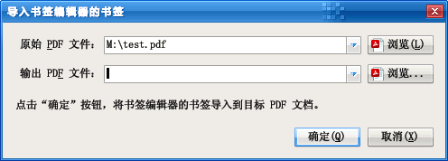

选择目标PDF文件后，点击“确认”按钮，程序将复制原始PDF文件，生成带有书签的目标PDF文件。

提示：按住Ctrl键点击“保存”按钮可换名保存。打开的文档为PDF文件时，总是执行换名保存。

### 基本编辑功能

打开书签后，可使用编辑器界面修改书签的样式及属性。基本编辑操作分述如下。

#### 选择书签

使用鼠标点击书签项，项目颜色变成反白，表示书签被选中。

编辑器的命令通常只作用于被选中的书签。要使编辑命令作用于内部书签，可选中“修改操作包含未选中的内部书签”复选框。

如需要同时选中多个书签，可按住键盘的Shift键或Ctrl键，再用鼠标点击需要选择的书签（按住Shift键点击，选择一定范围内的所有书签；按住Ctrl键点击，逐个选择鼠标点击过的书签；当书签被选中时，按住Ctrl键再点击该书签将取消其选中状态）。

按键盘的Ctrl+A组合键，可选中所有显示的书签。

注意：按Ctrl+A组合键不会选中未被展开的子书签。

#### 在编辑器中展开或收拢书签

当打开书签文件时，书签默认处于折叠状态。例如加载某文档的书签后，书签编辑器如下图所示。从图中可看到，顶层书签有三个，点击书签的动作是转到PDF文档由“页码”栏列出的页面。

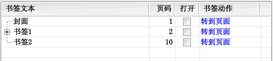

图表 4–32：加载某PDF书签后的编辑器界面

文本为“书签1”的书签项左方有一个加号，表示该书签包含子书签。点击该加号，收拢在书签内的子书签就会显示出来，然后加号会变成减号。如下图所示。从图中可见，“子书签1”还包含子书签，而“子书签2”和“子书签3”则不包含子书签。

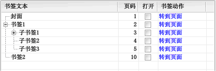

图表 4–33：展开书签以显示其子书签

点击书签文本左方的减号，其子书签又会收拢回去，恢复展开前的状态。

#### 移动或复制书签

选中书签后，用鼠标点住需要移动书签的文本区域，然后拖动鼠标，就可以移动书签。将鼠标移到其它书签上面，释放鼠标按键，就可使选中的书签移到放开鼠标的位置。

例如，在下图中选中“孙书签1”和“子书签2”两个书签后，用鼠标将其拖动到“子书签1”书签上。在“子书签1”上将显示一个蓝色的矩形。

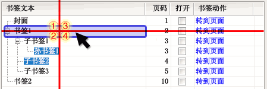

图表 4–34：移动或复制书签

蓝色的矩形有四个区域，在不同区域放开鼠标有不同移动方式。以上图为例。

在①区域上放开鼠标，选中的书签将移动到“书签1”的前面。

在②区域上放开鼠标，选中的书签将移动到“书签1”的后面。

在③区域上放开鼠标，选中的书签将移动到“书签1”的所有子书签的前面。

在④区域上放开鼠标，选中的书签将移动到“书签1”的所有子书签的后面。

移动书签后的效果分别如下图各标记所示（被移动的两个书签已用颜色标记）。

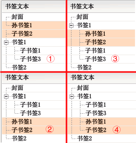

图表 4–35：移动书签的效果

说明：在拖动书签时，按键盘的Esc键可取消拖动操作。

在拖动书签放开鼠标时，按住键盘的Ctrl键可复制书签，即原选中书签将在原处保留，在新位置中创建选中书签的副本。按住键盘的Ctrl键和Shift键放开鼠标，复制的书签将包含选中书签的子书签。

#### 修改书签文本

方法一：选中需要修改的书签，然后用鼠标再点击该书签项（或按键盘的F2键），书签文本将进入编辑状态。完成编辑后，按回车键（或用鼠标点击其它书签项目）确认修改。如要取消编辑操作，可按键盘的Esc键退出编辑。

方法二：点击书签对应“动作”列的文本，将弹出一个属性框。在该属性框中修改“书签文本”文本框的文本，然后点击“确定”按钮关闭对话框。详见“修改书签属性”小节。

#### 修改书签属性

点击书签项对应“动作”列的蓝色文本，将弹出一个属性框。如下图所示。

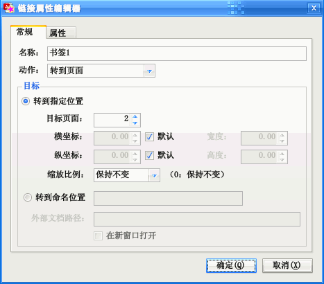

图表 4–36：链接动作编辑器

在该属性框中：

修改“名称”文本框对应的文本可修改书签的文本。

在“类型”下拉框中可选择点击书签后执行的动作。

在“目标”分组框中可指定书签的目标位置（一般选择“转到指定位置”单选框）。横坐标为“默认”时，点击书签后保持横坐标偏移位置不变。纵坐标选择“默认”时，点击书签后默认转到页面顶部。如横坐标或纵坐标值为0，则点击书签后保持阅读器原来的坐标偏移值不变。

点击“确定”按钮关闭对话框，确定修改。

点击“取消”按钮，则取消修改书签属性的操作。

#### 设置书签样式

书签的样式有粗体、斜体两种，还可以设置书签文本的颜色。在工具栏均有对应的按钮。

提示：在设置书签文本颜色时，如选择白色，则还原书签文本为默认颜色。

#### 设置书签的默认打开状态

书签默认的打开状态可通过修改“打开”列的复选框选中状态而设置。该复选框选中打钩时，书签在阅读器中默认打开（显示其子书签），不选中打开复选框时，书签在阅读器中默认折叠（子书签不可见）。

使用“修改”菜单的“设置书签默认打开状态”命令可修改多个书签的默认打开状态。

#### 插入书签

点击“插入书签”按钮，或按键盘的Insert键，可插入一个新的书签项。

提示：用按住Ctrl键拖放书签的方法，也可以复制创建新的书签。

#### 删除书签

选中书签后，点击“删除”按钮，或按键盘上的Delete键，可删除选中的书签。

删除书签时，如书签包含子书签，则子书签也会被删除。要避免删除子书签，请在删除前将子书签移出，再删除书签。

#### 编辑修改子书签

在一般场合下，修改书签操作不会影响其子书签或子书签包含的书签。按Ctrl+A组合键全选书签时也不会选中未展开的子书签。

如需修改子书签，一种方法是将书签展开，使子书签显示出来，然后再选中子书签进行修改。如下图同时选中“书签1”和“子书签2”两书签准备修改。

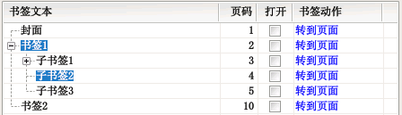

图表 4–37：选择被展开的子书签以备编辑

另一种方法是选中“修改功能作用于未选中的内部书签”复选框。选中该复选框后，不论书签是否展开，编辑器的命令将既修改选中书签，又修改其包含的内部书签。如下图所示。

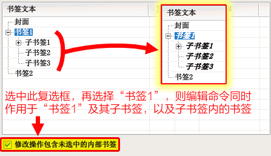

图表 4–38：选中“修改操作包含未选中的内部书签”执行修改

注意：按住Shift键再点击书签编辑器的命令，编辑命令会作用于书签的内部书签，相当于临时选择了“修改功能作用于未选中的内部书签”复选框。

#### 缩进书签层次

点击工具栏的“→”按钮，或按键盘的Tab键，可将选中书签向内缩进一层。

除此之外，还可使用鼠标拖放的方式改变书签位置（见前文“移动或复制书签”小节）。

#### 更改书签目标页码

点击书签列表“页码”列，可修改书签的目标页码。

如需一次修改多个书签的目标页码，可使用“修改”菜单下“更改目标页码”的指令，或按小键盘上的加号键或减号键，增减选定书签的页码。

此外，点击“动作”列的链接，在弹出的对话框中也可更改书签的目标页码。

### “修改”菜单功能

“修改”菜单包含了大量为编辑PDF书签而设的功能。在使用这些功能时，请留意“修改功能作用于未选中的内部书签”复选框是否选中。没有选中该复选框时，修改功能仅作用于选中的书签；选中该复选框时，修改功能还作用于选中书签的下级书签。此菜单若干功能在前文已有讲述，下文将介绍前文未讲述的命令。

#### 更改书签的显示方式

某些书签点击后会更改阅读器的显示比例。一般来说，这种行为并不是读者所需要的。如需去除书签对显示比例的影响，可使用“更改书签的显示方式”命令，将显示比例设置为“保持不变”。

使用此菜单命令，也可指定点击书签后缩放到指定的比例，如“适合页面”、“适合页宽”等。

如果只需要更改某一个书签的显示方式，也可点击书签列表“动作”列的链接，在弹出的对话框中选择所需的缩放比例。

#### 清除坐标定位偏移

某些书签点击后会使阅读器视图偏移一定的方向，可使用此功能清除其影响。

#### 更改目标页面坐标

此功能可更改点击书签后转到目标页面后的定位坐标。命令界面如下所示。

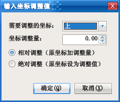

图表 4–39：“输入坐标调整值”对话框

对大部分书签而言，只需编辑方位为“上”的坐标。“相对调整”是在原坐标基础上增加坐标调整量（调整量为负数则表示减少原坐标）。“绝对调整”是将坐标调整量设为坐标值。

如只需调整单一书签的坐标，可点击书签列表“动作”列的链接，在弹出的对话框中编辑书签目标坐标值。

#### 合并书签

此功能是将多个同级书签合并为一个书签。合并后书签的文本为原选定书签文本的串联。

如果被合并书签包含子书签，则所有子书签将变为合并后书签的子书签。

### 搜索及替换书签文本

书签编辑器的另一大特色是可以批量搜索并替换书签文本。点击“搜索及替换书签文本”按钮，将弹出如下图所示的对话框，使用该对话框可完成搜索替换书签文本任务。

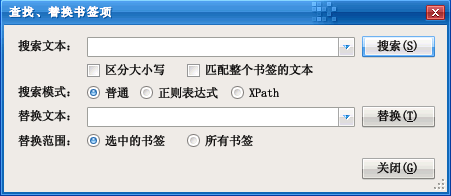

图表 4–40：“搜索及替换书签文本”对话框

在“搜索文本”框中，可输入需要搜索的文本。点击右侧的三角按钮，可选择之前用来搜索的文本。

默认搜索不区分英文大小写，如需区分，可选择“区分大小写”复选框。

默认搜索是模糊搜索，即只要书签文本有部分匹配搜索文本，就算是匹配。选择“匹配整个书签的文本”复选框后，只有书签文本完全匹配搜索文本时，才算是匹配。

搜索模式有三种。

第一种是“普通”模式，用来检索书签文本是否包含搜索文本。

第二种是“正则表达式”模式，搜索文本被视为一个正则表达式，当书签文本符合该表达式时，就算是匹配。

第三种是“XPath”模式。在该模式下，书签编辑器的书签被视为一个XML文档，每个书签是一个“书签”元素，书签的属性（如目标页码、动作等）则被视为XML“书签”元素的属性。搜索文本被视为一个XML路径表达式，当书签元素匹配该表达式时，视为匹配。书签XML文档的结构可参考信息文件的[文档书签](#文档书签)一节。

在“替换文本”框中输入替换匹配搜索内容的文本。如果使用正则表达式搜索模式，并在搜索表达式中指定了分组匹配，在替换文本中可用“\$1”、“\$2”等方式替代匹配分组。

#### 正则表达式搜索示例

下面以数则示例说明正则表达式搜索的用途。设书签编辑器已加载的书签如下图所示。

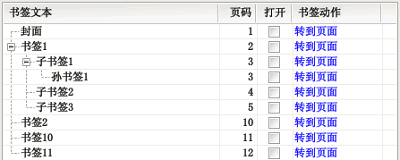

图表 4–41：示例书签

表格 4–5：正则表达式搜索示例

| 要匹配的书签               | 表达式            | 搜索结果               | 说明                                                                 |
| -------------------- | -------------- | ------------------ | ------------------------------------------------------------------ |
| 示前面的模式               | .\*            | 所有书签               | “.”表示任意字符；“\*”表示前面的模式出现0或任意次，“.\*”表示任意字符出现0或任意次                    |
| 以“书签”开头              | ^书签            | 书签1、书签2、书签10、书签11  | “^”表示文本的开头                                                         |
| 以“书签1”结尾             | 书签1\$          | 书签1、子书签1、孙书签1、书签11 | “\$”表示文本的结尾                                                        |
| 包含“子书签”或“孙书签”        | [子孙]书签         | 子书签1、子书签2、子书签3、书签2 | “[]”里面表示范围匹配，只要被匹配文本的字符符合范围里的任一个字符就是匹配了，该表达式相当于匹配“子书签”或“孙书签”文本     |
|                      | 子书签\|孙书签       |                    | “\|”表示“逻辑或”的关系，此表达式的含义即“子书签”或“孙书签”                                 |
| 书签文本完全匹配“书签1”或“子书签1” | ^子?书签1\$       | 书签1、子书签1           | “?”表示前面的内容不出现或出现1次                                                 |
|                      | ^(书签1\|子书签1)\$ |                    | “()”表示里面的内容为一组                                                     |
| “书签”后跟一个非1的数字        | 书签[2-90]       | 子书签2、子书签3、书签2      | “[]”里面表示范围匹配，“2-9”表示匹配2到9的字符，后面的“0”匹配字符“0”，在这个集合中不包含1，所以就匹配了非1的数字  |
| “书签”后跟一个非1的字符        | 书签[^1]         | 结果同上               | “[^]”表示筛选范围匹配，被匹配文本不能是方括号里面的任一个字符，“[^1]”表示不能是1的任意字符（可能是汉字或标点等）     |
| 包含两个数字               | [0-9]{2}       | 书签10、书签11          | “{2}”表示匹配前面的模式两次，“[0-9]{2}”即匹配2位数字                                 |
| “书签”后跟若干个数字          | ^书签[0-9]+      | 书签1、书签2、书签10、书签11  | “+”表示匹配前面的模式至少一次，“[0-9]+”表示匹配至少1个数字，又如“.+”表示匹配至少1个任意的字符            |
|                      | ^书签[0-9]{1,}   |                    | “{1,}”表示匹配前面的模式至少1次，相当于“+”号，又如“{2,}”表示最少匹配前面的模式两次，而“{2,3}”表示匹配2或3次 |

如搜索表达式使用了圆括号“()”分组，替换时可使用“\$1”、“\$2”等替代符替代分组的内容。

例如，需要将“子书签1”、“子书签2”的形式转换为“1)子书签”、“2)子书签”的形式（将数字提到前面），可使用搜索表达式“子书签([0-9]+)”定位书签，并用括号分组“([0-9]+)”捕获数字，然后用“\$1)子书签”作为替换文本，其中“\$1”表示替代搜索表达式中括号内匹配的数字。

再如，将“子书签1”、“孙书签1”、“子书签2”等的数字和文本互换位置，变成“1子书签”、“1孙书签”、“2子书签”等形式，可使用搜索表达式“([子孙]书签)([0-9]+)”，使用两对括号分组，第一组匹配“子书签”或“孙书签”，第二组匹配后面的数字，然后用“\$2\$1”作为替换文本执行替换即可。

更多关于正则表达式的内容，请参阅有关教程和资料。

#### XML路径（XPath）搜索示例

XPath搜索的原理是将书签信息文件看作一个XML文档，然后在其上面执行XML路径匹配。符合XML路径表达式的书签将被选中。使用XML路径搜索可完成普通搜索无法完成的搜索任务。

每个书签在XML文档中以“书签”元素表示，书签的属性（如页码、动作等）以XML属性表示，子书签被视为上级书签的子元素。

以上节插图所示的书签为例，举XML路径匹配数例如下表所示。

| 要匹配的书签             | 表达式                          | 搜索结果             | 说明                                                                                                          |
| ------------------ | ---------------------------- | ---------------- | ----------------------------------------------------------------------------------------------------------- |
| 文本为“书签1”           | @文本='书签1'                    | 书签1              | “@文本”表示书签的文本，需要匹配的文本字符串以英文单引号“'”或双引号“"”括起；等号表示比较两边的值是否相等                                                    |
| 目标页码范围为5到10        | @页码 \>= 5 and @页码 \<= 10     | 子书签3、书签2         | “@页码”表示书签的目标页码，“and”表示“逻辑与”关系；“\>=”表示大于或等于关系，而“\<=”表示小于或等于关系                                                |
| 样式为粗体              | @样式='粗体'                     | 没有匹配的书签          | “@样式”表示书签的粗体或斜体样式；本示例中没有样式为粗体的书签                                                                            |
| 有子书签的书签            | 书签                           | 书签1、子书签1         | “书签”表示检查是否有名为“书签”的子书签                                                                                       |
| 子书签内还有子书签的书签       | 书签/书签                        | 书签1              | 第一个“书签”匹配有子书签的书签，“/”表示向内一层，第二个“书签”表示匹配上述已匹配书签内还有子书签的书签                                                      |
| 和上层书签指向相同页码的书签     | ../@页码 = @页码                 | 孙书签1             | “../”表示上层书签，“../@页码”则表示获取上层书签的“页码”属性，第二个“@页码”是当前书签页码；当上层书签的页码与当前书签页码相等时，等式成立（“孙书签1”的页码和其上层书签“子书签1”指向的页码均为3） |
| 有文本以“孙书签”开头的子书签的书签 | 书签[starts-with (@文本, '孙书签')] | 子书签1             | 首先“书签”筛选了拥有子书签的书签，然后“[]”表示其中的内容为这些子书签的判定条件，若条件成立，视为匹配；“starts-with”是函数，当第一个参数以第二个参数开始时，视为判定成立               |
| 文本包含“子书签”          | contains(@文本, '子书签')         | 子书签1、子书签2、子书签3   | “contains”函数表示检查第一个文本参数是否包含第二个文本参数的内容                                                                       |
| 同级内的第一个书签          | position() = 1               | 封面、子书签1、孙书签1     | “position”函数返回当前书签的位置；只计算位置时，可用简化表达式“1”                                                                     |
|                    | 1                            |                  |                                                                                                             |
| 同级内的最后一个书签         | last()                       | 孙书签1、子书签3、书签2    | “last”函数返回最后一个同级书签的位置，当书签是最后一个书签时，其位置等于该函数返回的值（本表达式相当于“position()=last()”）                                  |
| 位置不是同级书签内最后一个的书签   | following-sibling::书签        | 封面、书签1、子书签1、子书签2 | “following-sibling::书签”表示同级下一个书签；每层内最后一个书签是没有下一个同级书签的，因此本要求相当于匹配有下一个同级的书签                                   |
| 有3个子书签的书签          | count(书签)=3                  | 书签1              | “count”函数返回匹配其括号中表达式的节点个数                                                                                   |

更多关于XML路径的内容，请参阅有关教程与资料。

## 识别图像文本

识别图像文本功能可将PDF文档内图片的文字识别出来，变成可编辑的文本文件，在编辑文件后，可将该文本写入PDF文档成为透明的文本层，使PDF文档的图像文本可被检索工具索引。

注意：本功能要求机器上安装微软Office 2003或Office 2007的Document
Imaging组件及对应的语言识别模块。

本功能的界面如下图所示。

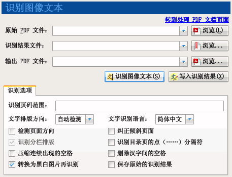

图表 4–42：识别图像文本功能

### 识别图像文本操作步骤

1. 选择“识别图像文本”功能。

2. 点击“原始PDF文件”右边的“浏览”按钮，指定需要识别图片文字的PDF文件路径。

3. 如需将识别结果保存为文本文件，则点击“识别结果文件”右边的“浏览”按钮，指定保存文本文件的位置。如在识别过程不指定此文件路径，程序将把识别结果输出到日志窗口。

4. 在“识别页码范围”文本框中输入需识别图像文本的页码，如不输入，则识别所有页面的图片。

5. 点击“识别图像文本”按钮，开始识别。

   说明：如识别结果文件的后缀为“.xml”，则输出的信息文件将包含所识别文本在页面中的坐标信息。

### 写入识别结果操作步骤

1. 选择“识别图像文本”功能。

2. 点击“原始PDF文件”右边的“浏览”按钮，指定生成识别结果文件的PDF文件路径。

3. 点击“识别结果文件”右边的“浏览”按钮，指定识别后保存的XML结果文件路径。

4. 点击“输出PDF文件”右边的“浏览”按钮，指定写入识别结果后生成的PDF文件路径。

5. 点击“写入识别结果”按钮，开始识别。

### 识别选项

如原文档图片中的文字是统一排版方向（即全是横排或全是竖排），建议在“文字排版方向”下拉框中选择对应的排版方式。

在“文字识别语言”下拉框中可选择识别语言，默认的是简体中文，此外可选繁体中文或英文。

说明：识别图像文本功能是通过调用微软Office Document
Imaging组件的识别引擎来识别文本的。因此，必须先安装对应的语言识别组件。如果只安装了简体中文识别引擎，显然是无法正确识别繁体中文的。

“旋转校正”和“拉伸校正”复选框可让识别引擎尝试识别图像中文本的旋转方向和倾斜角度，以提高识别效果。为提高识别速度，默认不选择此二选项。

选中“检测页面方向”复选框，可让程序自动识别页面是横向还是纵向。

选中“纠正倾斜页面”复选框，可让程序自动纠正倾斜的页面，提高识别正确率。

说明：选中上述两个选项均需要执行更多的运算，如识别结果较理想，无需选择上述两选项，以便提高识别速度。

选择“保存原始的识别结果”复选框时，原样保存微软Office识别组件输出的识别结果。在需要将识别结果写入PDF文档时，建议选中该选项。不选中该复选框时，程序尝试将同一行的文本组合在一起，以便提取识别文本内容。

### 识别目录页为简易书签文件

识别图像文本的一个功能是将扫描PDF文档目录页识别成简易书签文件，用于快速制作PDF书签。

微软Office的识别引擎在识别目录页时效果不太好，识别引擎通常会将目录中的点号（即连续出现的省略号“……”）误识别为一系列的句号或数字“0”等字符。建议选中“识别目录页的点（……）分隔符”复选框，这样程序会尝试纠正识别引擎的错误结果。

此外，建议选中“压缩连续出现的空格”复选框，必要时可再选中“删除汉字间的空格”复选框，并取消“识别分栏排版”复选框（当文字排版方向为“自动检测”时，无法切换此复选框的选择状态，需手工指定排版方向才能切换此复选框）。

识别之后输出的文本文件可直接用[书签编辑器](#编辑书签文件)打开。

使用书签编辑器的“更改目标页码”功能可修复目录页码与实际页码的对应关系。

## 提取图片

提取图片功能可将PDF文档的图片无损导出为图片文件。

本功能的界面如下图所示。

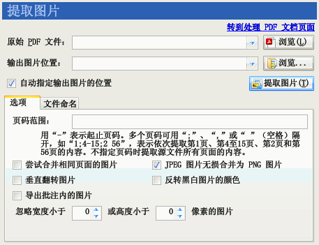

图表 4–43：提取图片功能

### 操作步骤

1. 选择“提取图片”功能。

2. 点击“原始PDF文件”右边的“浏览”按钮，指定需要提取图片的PDF文件。

3. 点击“输出位置”右方的“浏览”按钮，将弹出一个目录浏览框。利用该对话框选择一个目录，导出的图片将存放到该目录。

4. 点击“提取图片”按钮。

5. 程序界面转到“输出信息”界面。程序将打开PDF文件，并将文件中的图片导出到之前指定的目录。在导出过程中，可随时点击输出信息界面中的“返回”按钮终止导出过程。

### 提取选项

页码范围：指定导出特定范围页码的图片。如不指定“页码范围”，则导出PDF文件中可以找到的所有图片。

尝试合并相同页面的图片：尝试将同一页内具有相同水平坐标、相同宽度和相同格式的图片合并为一副图片。提供这个功能的原因是有些PDF制作工具会将一副图片分割成多片，逐片写入PDF文件。这样，提取出来的图片将是零散的。使用此功能会将这些零散的图片重新整合为一个图片。

JPEG图片无损合并为PNG图片：选择“尝试合并相同页面的图片”时，如合并前的图片为JPEG图片，则将这批图片无损合并为PNG图片。

垂直翻转图片：将导出的图片垂直翻转。有些PDF制作工具将图片垂直翻转后写入PDF文件。这样，提取出来的图片将上下颠倒。使用此功能可将上下颠倒的图片还原回来。

注意：如果图片采用JPEG等有损格式压缩，垂直翻转图片可能导致提取图片的质量下降。

反转黑白图片的颜色：将只有两种颜色的图片反转颜色。有些PDF制作工具会将图片黑白颠倒，然后在PDF的渲染指令中使用设定绘图颜色的方式将颜色在渲染时颠倒过来。这样会导致提取出来的图片黑色和白色相反。使用此功能可将相反的颜色还原回来。

忽略指定宽度或高度的图片：某些PDF文件包含一些很小的图片。如不需要导出这些图片，可使用此选项将其忽略。

导出批注内的图片：选中此选项后，导出批注内的图片。不选中此选项时仅导出PDF正文的图片。

### 文件命名规则

提取出来的图片文件名默认为页数编号的四位数文件名称（掩码为“0000”），如“0001.jpg”、“0002.tif”、“0010.tif”等。文件名的扩展名部分则根据PDF文档中图片采用的压缩方法自动生成。例如：图片是JPEG算法压缩的，扩展名为“jpg”；黑白两色的（使用CCITTFax或JBIG2算法压缩），扩展名为“tif”；彩色或灰度的（使用Deflate等算法压缩），扩展名为“png”。

提取图片文件扩展名前面的部分可以通过更改“文件名掩码”修改。

如不需用0填充位数，可输入掩码“0”或不输入掩码，程序将输出图片文件名如“1.jpg”、“2.tif”、“10.tif”等。

如果在掩码中填入汉字，则输出文件名包含汉字名称。如掩码“文档000”将生成“文档001.jpg”、“文档002.tif”等图片文件。

如果文件名不变的部分包含“0”，可用半角引号“"”将不变的部分括起来。如掩码“"Windows
2008参考大全"0”，将生成“Windows 2008参考大全1.jpg”、“Windows
2008参考大全2.png”等图片。

更改文件掩码时，“示例”标签将演示第1、2、3、11、12、13和100页的图片文件命名情况。

## 提取页面

提取页面内容功能可以将PDF文档指定范围的若干页面导出成一个单独的PDF文件。

本功能的界面如下图所示。

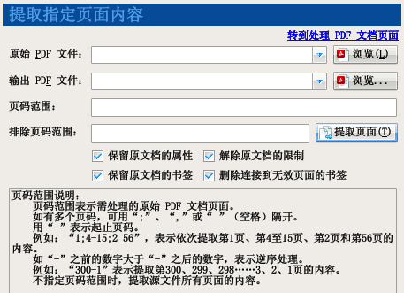

图表 4–44：提取页面功能

提取页面的操作方法如下所示：

1. 选择“提取页面”功能。

2. 点击“原始PDF文件”右边的“浏览”按钮，指定需要提取页面的PDF文件。

3. 点击“输出位置”右方的“浏览”按钮，将弹出一个保存文件浏览框。利用该对话框指定提取页面后制作PDF文件的保存位置。

4. 如仅需导出特定范围页码内的内容，可在“页码范围”右边的文本框中填入页码范围。如不指定页码范围，则导出PDF文件的所有页面。

5. 如有某些页码不需提取，也可在“排除页码范围”文本框中填入需剔除的页码范围。

6. 点击“提取页面”按钮。

7. 程序界面转到“输出信息”界面。程序将打开原始PDF文件，并将指定范围内的页面导出为一个新的PDF文件。在导出过程中，可随时点击输出信息界面中的“返回”按钮终止导出过程。

   > **提示**
   >
   > 页码范围支持逆序范围，如页码范围“10-1”，将先插入源文件的第10页，再插入第9页，以此类推，最后插入第1页到输出文档。除使用本功能导出PDF文件的指定页面，还可以使用“制作PDF文件”功能，从已有PDF文件导出页面生成新PDF文件。

## 文档结构探查器

文档结构探查器为PDF开发人员、爱好者等提供了一个查看、修改PDF文档内部结构的工具。

本功能的界面如下图所示。

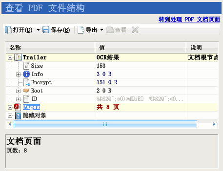

图表 4–45：文档结构探查器界面

操作方法：

1. 选择“文档结构探查器”功能。

2. 点击“打开”按钮，打开感兴趣的PDF文档。

   > **提示**
   >
   > 可以从“我的电脑”或资源管理器将PDF文档拖到功能界面以打开该文档。

3. 稍等片刻，待程序打开文档后，程序以树型列表展示PDF文档内部层次结构。

4. 列表第一列是节点的名称。某些节点（如字典、数组类型节点）包含内部节点，则该节点图标左方具有一个加号。点击加号可展开节点，查看内部节点的内容。某些指向字典或数组的引用节点，其图标左方也有加号。点击该加号可展开查看引用节点指向目标的内容。

5. 文档的根节点是文档编录（Trailer）节点。

6. 为方便使用，程序将文档的各个页面转换成单独的页面节点，独立显示在Pages节点下（该节点为虚拟节点，实际上是根据文档内部的页面树字典生成的）。

7. 列表第二列是节点的值，用鼠标点击对应的单元格，可修改其内容。

8. 列表下方是备注窗口，讲解所选节点的含义及其取值范围。程序内置数十个常见PDF节点的信息，可供PDF爱好者参考。

9. 点击“删除”按钮可删除选中的节点。有些节点在文档中是必须存在的，不能删除。选择该节点时，“删除”按钮将被禁用（显示成灰色按钮）。删除字典或数组节点时，字典或数组的内容节点也将被删除。删除引用节点时，仅删除该节点，不会删除该节点指向的目标节点。

10. 选中文档的数据流节点，按“导出”按钮，可将内容节点导出成二进制文件或文本文件供外部程序分析。

11. 选中文档内的图像数据流，按“查看”按钮，将弹出一个窗口显示数据流的图片。

12. 选中文档内的文本数据流，按“查看”按钮，在备注窗口可查看文本流的内容。

13. 在修改文档后，如需保存修改后的文档，可点击“保存”按钮。

    > **警告**
    >
    > 在使用文档结构探查器前，应准备一定的PDF知识。如果此工具使用不当，并将修改后的文档覆盖原始PDF文件，将可能导致丢失数据，造成无可挽回的损失。

## 全局选项

此选项指定程序各功能通用的工作方式。

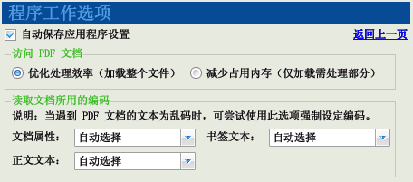

图表 4–46：程序的全局工作选项

访问PDF文档：指定程序读取PDF的策略。选中“优化处理效率”，则程序尽量将整个PDF文件加载到内存，方便提高处理效率。选中“减少占用内存”，则程序仅加载PDF的索引表，尽量减少使用内存的数量。如PDF文档较大，可使用此选项以免程序因加载文档而耗尽内存。

读取文档所用的编码：有些PDF文档采用了不规范的编码，导致无法正常阅读，导出的信息文件也为乱码。可使用此选项强制指定读取编码形式，尝试以不同的编码形式导出信息。详细使用方法请参见修复文字为乱码的书签。

## 输出信息

界面的“日志内容”文本框输出程序工作过程的信息和遇到的错误。程序开始执行任务后将转到此界面。

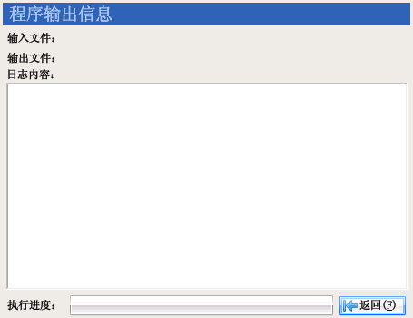

图表 4–47：输出信息界面

在程序工作过程中，点击“返回”按钮将弹出一个确认对话框，在对话框中点击“是”按钮将终止程序的工作。

在程序完成工作后，点击“返回”按钮将返回到之前的功能界面。

点击日志窗口带下划线的文件名或目录名可打开对应的文件或目录。

# 应用示例

为更好的讲解PDF补丁丁的使用方法，这里设立了几个情景示例，读者可举一反三，将程序用得更好。

## 取消书签及页面链接的显示比例

任务：有些PDF文档的书签或页面链接点击后会改变阅读器的显示比例，例如读者本来使用135%的显示比例，点击书签后，显示比例变成了适合页面，字体变得很小。这为读者阅读造成了不便。使用PDF补丁丁可轻易地保持阅读器显示比例，不让其自由改变而影响阅读。

操作步骤如下：

1. 选择“PDF文档选项”功能。

2. 点击“阅读方式”选项卡，选中“禁止书签及页面链接更改显示比例”复选框。

3. 选择“处理、制作PDF文档”功能的“独立补丁”模式。

4. 向文件列表添加需要修改的PDF文档。

5. 指定输出PDF文件的路径。

6. 点击“生成PDF文件”按钮。在生成的新文件中，点击书签和页面链接都不会更改阅读器的显示比例了。

处理过程的示意图如下所示。

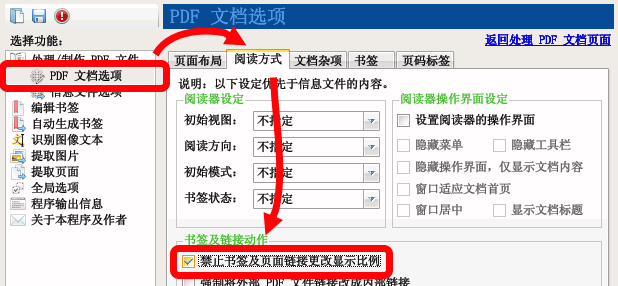

图表 5–1：补丁步骤1～2：选择补丁选项

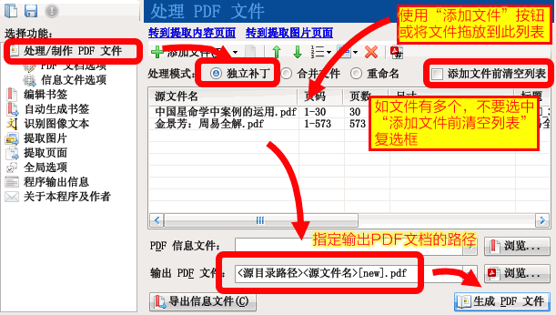

图表 5–2：补丁步骤3～6：选择文件执行补丁

## 关闭默认展开状态的书签

任务：有些PDF文档具有书签，方便阅读。但书签数量和层数都很多，而且全部处于默认展开的状态，要翻动滚动条才能找到需要的项目。将书签默认状态改为关闭，在阅读时再手动打开，通常比默认打开所有书签要方便。使用PDF补丁丁可批量改变文档书签的打开状态。

### 用独立补丁功能修改多个PDF文件的书签打开状态

使用独立补丁功能修改书签打开状态的操作步骤如下：

1. 选择“PDF文档选项”功能。

2. 点击“阅读方式”选项卡，找到“书签状态”下拉框，选择“全部关闭”。

3. 选择“处理、制作PDF文档”功能的“独立补丁”模式。

4. 向文件列表添加需要修改的PDF文档。

5. 指定输出PDF文件的路径。

6. 点击“生成PDF文件”按钮。在生成的新文件中，书签都是关闭状态了。

### 用书签编辑器修改单个PDF文件的书签打开状态

使用书签编辑器修改PDF文档书签打开状态的操作步骤如下：

1. 选择“编辑书签”功能。

2. 点击“打开”按钮，打开需要修改的PDF文件。

3. 批量选中需要修改打开状态的书签，然后选择“修改”菜单下“设置书签默认打开状态”子菜单相应命令。

4. 点击“补丁”按钮，保存修改后的PDF文件。

   提示：如选中的书签内还有子书签，请选中“修改操作包含未选中的内部书签”复选框，以将修改命令应用到内层书签。

与“独立补丁”功能相比，此方法可按需令某些书签默认打开，但显然无法批量处理PDF文件。

## 统一页面的尺寸

任务：某PDF文件页面尺寸参差，希望能统一其页面尺寸方便阅读。使用PDF补丁丁的操作步骤如下。

1. 选择“PDF文档选项”功能。

2. 在“页面布局”选项卡，默认状态下，尺寸下拉框为“等同原始内容尺寸”，可将其改为其它已定义好的尺寸，如“A4”、“16开”等，或选择“自定义”，然后在“宽”、“高”处输入适当的数值。

3. 选择“源PDF页面调整”组内的“缩放内容适应页面”单选框。

4. 返回“处理、制作PDF文档”功能，选择“独立补丁”模式。

5. 添加需要统一页面尺寸的文件并指定输出PDF文件。

6. 点击“输出PDF文件”按钮。

操作过程所选择的选项如下图所示。


图表 5–3：补丁步骤2～3：为PDF文档选择统一尺寸

> **提示**
>
> PDF文档第一页的尺寸在文件列表上已列出。

## 调整竖排文档的双页阅读顺序

任务：现在流行宽屏显示器，有些较大的宽屏显示器可一次显示两页文档。切换到双页视图将可减少翻页次数，便于阅读。但双页显示的默认阅读方向是“从左到右”，对于竖排文档而言，则不便阅读：首先要从页面中间开始，读到页面左下角，再跳到页面右上角读下一页。如下图左所示。

如可改变阅读方向，改为“从右到左”，则阅读竖排文档将更为方便：从页面右上角开始阅读，到左下角读完两页，视线不需拐弯。如下图右所示。


操作步骤如下：

1. 选择“PDF文档选项”功能。

2. 点击“阅读方式”选项卡。

3. 在“阅读方向”下拉框中选择“从右到左”。

4. 返回“处理、制作PDF文档”功能，选择“独立补丁”模式。

5. 添加需要删除动作的PDF文件。

6. 指定输出PDF文件的路径。

7. 点击“生成PDF文件”按钮。用PDF阅读器打开生成的新PDF文件，切换到双页视图后，会发现阅读顺序已改为从右到左了。

## 禁止打开文档时自行设定“适合页面”显示的行为

任务：某些 PDF
文档在打开时自动将阅读器的显示比例设置为“适合页面”，导致显示字体过小，每次阅读时均需人工调节显示比例，颇为不便。用
PDF 补丁丁可以禁止文档的这种行为。

操作步骤如下：

1. 选择“PDF文档选项”功能。

2. 点击“文档杂项”选项卡。

3. 选中“删除打开文档时自动执行动作”复选框。


图表 5–4：选择“禁止打开文档时自动执行动作”选项

1. 返回“处理、制作PDF文档”功能，选择“独立补丁”模式。

2. 添加需要删除动作的PDF文件。

3. 指定输出PDF文件的路径。

4. 点击“生成PDF文件”按钮，程序将读取原始PDF文件，删除文档的自动执行动作，并输出为新的PDF文件。

## 清除打开页面时弹出的网页

任务：某PDF文件在阅读到某一页时，自动打开浏览器访问特定的网站。这是由于该PDF文件在页面中执行了打开网页的动作。使用PDF补丁丁可以删除这些动作。

操作步骤如下：

1. 选择“PDF文档选项”功能。

2. 点击“文档杂项”选项卡。

3. 选中“删除页面上自动执行动作”复选框。

4. 如在打开文档时也有网页弹出，可选中“删除打开文档时自动执行动作”复选框。

5. 返回“处理、制作PDF文档”功能，选择“独立补丁”模式。

6. 添加需要删除动作的PDF文件。

7. 指定输出PDF文件的路径。

8. 点击“生成PDF文件”按钮，程序将读取原始PDF文件，删除页面中的自动执行动作，并输出为新的PDF文件。

## 导出文本形式的书签

任务：将PDF文件的书签导出成文本形式的目录。

操作步骤如下：

1. 选择“处理/制作PDF文件”功能。

2. 选择“独立补丁”模式。

3. 在文件列表中添加需要导出目录的PDF文件。

4. 在“PDF信息文件”处，指定一个后缀为“txt”的文本文件作为输出信息文件。

5. 点击“导出信息文件”按钮。导出的信息文件即为一个文本文件。

操作步骤如下图所示。


图表 5–5：导出文本书签信息文件

## 使用书签编辑器修复书签

某些PDF文档在制作时由于工具的限制，书签不符合PDF规范，在新版本的PDF阅读器中无法正常使用，通常的问题有：书签文本乱码、PDF文件改名后书签失效、书签指向的目标页码范围不正确。

使用PDF补丁丁的书签编辑器可以轻松修复此类PDF书签问题。

### 修复书签文本乱码

任务：某PDF文档的书签为乱码，无法阅读，如下图所示。


图表 5–6：乱码书签

使用书签编辑器加载该文档，发现书签文本也为乱码。如下图所示。


图表 5–7：在书签编辑器中显示的乱码书签

使用程序全局选项中的“读取编码”，可强制指定读取信息所用编码，然后重新打开书签。

操作步骤如下。

点击“全局选项”，转到程序的全局设置。

选择“读取编码选项”的选项卡。在“书签文本编码”中选择“UTF-16 Big
Endian”。如下图所示。


返回书签编辑器，点击工具栏的“打开”按钮，重新加载有问题的PDF文档。这时可以看到，书签文本已经正常（如果不能正常显示，返回步骤2选择其它编码，再重复此步骤），如下图所示。


### 修复PDF文件改名后失效的书签

上述PDF文档的书签貌似已经修复，但还有问题。一旦更改了PDF文件名，打开文档点击书签就会出现“无法打开文档j24.pdf”之类的错误，如下图所示。只有将PDF文件名改回“j24.pdf”，书签才能正常工作。

出现这种问题的原因是：PDF
文档书签使用了指定文件名的外部链接，而不是文档内部链接。


为解决上述问题，书签编辑器提供“强制将外部链接改为内部链接”的功能。操作步骤如下：

用书签编辑器打开书签（结果见上节图所示）。在编辑器中可看到，书签动作是“打开外部PDF文档”。展开书签，发现所有书签项的动作均为打开外部PDF文档。随便点击编辑器“书签动作”列上任何一个“打开外部PDF文档”链接，在弹出的对话框中可以发现，书签动作指向了一个名为“j24.pdf”的文档。如下图所示。


这就是PDF文件改名之后链接失效的原因。只有当文件名为“j24.pdf”时，点击链接才能跳转到其指定的页面，否则由于不存在“j24.pdf”文件，PDF阅读器就会报告找不到文件的错误。

点击“取消”按钮关闭上述对话框，返回书签编辑器。

由于所有书签均存在同样的问题，可以用修改菜单的命令，一并修复。按Ctrl+A（或用鼠标选择）选中所有书签，选择“修改操作包含未选中的内部书签”复选框，使后续操作作用于隐藏在书签内部的子书签。

点击“修改”按钮，在弹出的菜单中选择“强制设置为文件内链接”命令。

完成后，从编辑器中可以看到，书签动作已经变为“转到页面”。如下图所示。


### 修改链接的目标页码

使用高级补丁功能将书签补丁回PDF文档后可以发现，书签指向的目标页面往前偏离了一页。本来应该指向第2页的，却跳转到第1页；应指向第16页的，却跳到第15页。使用书签编辑器可将所有页面的目标页码统一往后加一页。操作办法如下：

用书签编辑器打开书签（结果见上节图所示）。从书签编辑器中可以看到，第一个有效页面“马克思恩格斯全集（39）上”的页码指向了0。

选中“修改操作包含未选中的内部书签”复选框，使后续修改操作作用于隐藏在书签内部的子书签。

选中所有书签项。

点击“修改”按钮，在弹出的菜单中选择“增加页码”命令。

完成后，从编辑器中可以看到，页码均已增加了1。如下图所示。


另外，前面三个书签项没有必要保留，可用鼠标选中，然后点击工具栏的“删除”按钮将其删除。

### 将修改结果补丁回PDF文档

经过上面几步操作，书签已被成功修复了。最后一步是组合书签和原PDF文档，生成修复后的新文档。操作步骤如下：

点击编辑器的“保存”按钮，将书签保存为“.xml”后缀的信息文件。（如不需保存信息文件，可跳过此步骤）

点击“补丁”按钮，将弹出一个对话框。该对话框列出了原始PDF文件和输出PDF文件。在“输出PDF文件”处指定补丁输出文件的位置。

点击“确定”按钮，稍等片刻，刚才的修改成果就保存到生成的新PDF文件中去了。

## 添加简易书签

### 例一：使用Excel制作简易书签

手头上有一本没有任何书签的影印版《黄帝内经》。从网上我们可以很轻易地找到这本书的目录文本。将其复制下来，稍作处理，成为类似如下形式的一行一行文本：

上古天真论第一

四气调神大论第二

生气通天论第三

金匮真言论第四

……

再将这些文字复制到Excel工作表中，上面的文字成为A列（第1列）。

上述目录没有页码，因此，要加上页码，才能让书签跳转到指定页面。影印版的PDF通常都附有原书目录。用
PDF 阅读器打开该文件，转到目录页，然后对着将页码输入到Excel的B列（第2列）。

输入完之后，由于目录页中的页码和PDF文件中的真实页码有一定的差距。在这个影印版的PDF文件中，第一章出现在文件的第14页。因此，在Excel表的第1行前面插入一行，输入“\#首页页码=14”，表示下面的页码中第一页对应于PDF文件的第
14 页。Excel表看起来是如下的样子：


图表 5–8：使用Excel制作简易书签（第1行的“\#版本”指令可忽略不写）

完成了书签的输入工作后，用Excel将其保存为“书签.txt”文本文件（不能保存为XLS文件）。

打开PDF补丁丁。选择“处理、制作PDF文档”功能的“独立补丁”模式。向文件列表添加《黄帝内经》的PDF文件。在“PDF信息文件”处选择刚才保存的文本文件。在“输出PDF文件”处选择导入书签文件后所得的新PDF文件。

> **提示**
>
> 操作前要关闭Excel程序，否则程序无法读取信息文件。

点击“生成PDF文件”按钮，程序将把简易书签和原始文件合并，生成一个新的PDF文件。

> **说明**
>
> 除了使用“独立补丁”功能，也可以使用书签编辑器打开简易书签文件并执行补丁。

耐心等待程序处理完成。最后，我们就得到了一个具有书签的PDF文件。如下图所示。


图表 5–9：导入了简易书签的PDF文件

### 例二：制作多级目录的简易书签

上一示例讲解了制作简易书签的一般步骤，本节介绍制作较复杂一点的多级书签。

首先，输入需要制作的简易书签文本。本示例部分目录如下所示：

第一章 中国气功概况 1

一、 气功发展简史 1

二、 什么是“气功” 3

三、 练功的目的 5

四、 气功有什么效果 7

五、 气功功法分类及特点 9

养生气功 11

诊断气功 19

……

这个目录其实分三层，第一层是章，第二层是节，最后一层是小节。

将上面的文本复制到一个文本编辑器（如AkelPad、PSPad、EditPlus等）的编辑区中。选中上面“一、气功发展史”到“诊断气功”这几行，按一下键盘上的“Tab”键。这样，这几行前面就多了一个制表符，看起来就是缩了进去一层的样子。然后，在选中下面“养生气功”到“诊断气功”两行，再按一下“Tab”键，这两行又往内缩进了一层。成为如下形式：

第一章 中国气功概况 1

一、 气功发展简史 1

二、 什么是“气功” 3

三、 练功的目的 5

四、 气功有什么效果 7

五、 气功功法分类及特点 9

养生气功 11

诊断气功 19

……

用类似的方式处理后面几章的目录。

打开 PDF
文件，看看第一章对应的实际页码是第几页（本示例为第7页）。因此，我们在书签文件中第一行前面插入一行，添加“\#首页页码=7”指令，成为如下形式：

\#首页页码=7

第一章 中国气功概况 1

一、 气功发展简史 1

……

“\#首页页码=7”指令表示下面的页码第1页对应PDF文档中的第7页。

这本书前面还是有一个目录的。我们可以在书签文件中再加点东西，在书签中包含目录。在书签文件第一行前插入内容，成为如下形式：

目录 1

\#首页页码=7

第一章 中国气功概况 1

一、 气功发展简史 1

……

虽然“目录”和“第一章”的页码都是1，但“目录”对应PDF文件的第1页，而由于第二行“\#首页页码”指定了页码的关系，“第一章”实际对应第7页。

完成后将书签文件保存为文本文件。然后用PDF补丁丁将其导入到原始PDF文档，即可生成带书签的PDF文件。如下图所示。


图表 5–10：带有多层目录的PDF书签

### 例三：使用字符识别功能生成简易书签

为扫描PDF文档制作简易书签的又一种办法是使用字符识别功能识别目录页，用目录页的文本生成书签。基本操作步骤如下。

1. 在PDF阅读器中打开并观察文档，确定扫描PDF文档的目录页范围。

2. 转到“识别图像文本”功能，指定需识别的PDF文件，并选择适当的处理选项（建议选中“识别目录页的点分隔符”、“压缩连续出现的空格”两选项；为提高识别效果，可人工指定“文字排版方向”选项为横向或纵向；如扫描页面倾斜，可选中“旋转校正”和“拉伸校正”两选项）。

3. 在“识别页码范围”文本框中输入目录页的页码范围。

4. 指定识别文本后输出的文本文件，点击“识别图像文本”按钮，尝试识别目录页。

5. 编辑输出的文本文件，修正错误识别的字符。

6. 用书签编辑器打开该文本文件，制作成书签文件或直接补丁到PDF文档。

## 自动生成导航书签

自动生成导航书签是一个颇具实用价值的功能。该功能可为PDF文档自动生成书签，免却手工输入书签的不便。基本操作步骤有如下几步。

1. 观察文档，人工分析文档标题特征。

2. 尝试生成书签。

3. 调整标题识别选项以及增加筛选条件。

4. 在输出的日志窗口或书签编辑器查看输出的书签，如不满意，重复2、3两步。

5. 使用书签编辑器编辑、优化书签。

6. 生成PDF文件。

   > **说明**
   >
   > 自动生成PDF书签功能只能为文本PDF文档生成书签，无法处理扫描图片的PDF文档。

本参考手册PDF电子版的书签就是用自动生成书签功能生成的。本节将以本手册为例，讲述自动生成书签的详细操作步骤。

### 观察文档

自动生成书签的第一步是观察PDF文档，了解其排版特征。观察需要作为书签的文本具有何种特征。以本文档为例，文档标题有如下特征：①每个标题都使用较大尺寸的粗宋体或黑体，②字体尺寸随标题级别而渐次变小。③每个标题都是独占一行的。如下图所示：


图表 5–11：本参考手册的标题样式

### 尝试生成书签

由于PDF书籍的页数往往较多，处理一次需要一定的时间，首先使用程序的默认设置，尝试为某几个比较有代表性的页面——具有需要生成为书签的标题的页面，生成书签。观察这几页的标题是否能完全生成书签，并且没有引入正文的其它文本。

本示例中以默认配置尝试为使用文档第2～20页生成书签。选项配置如下图所示：


图表 5–12：使用默认配置为示例文档2～20页生成书签

点击“导出信息文件”按钮，程序将生成书签，并将文本显示到日志窗口，如下图所示。


图表 5–13：日志文件输出的书签文本内容

### 观察输出结果并调整标题识别选项

观察日志窗口输出的内容可以发现，按照默认的标题尺寸，只能输出到标题2，标题3和标题4的文本并没有包含到输出的书签中。

为将标题3和标题4的文本也输出为书签，可尝试调整标题识别选项，将“标题文本尺寸”参数从默认的13调整为较小的12，然后再点击“导出信息文件”按钮。如下图所示。


图表 5–14：调整标题文本尺寸参数以输出更低级别的标题

输出结果如下图所示。


图表 5–15：调整标题文本尺寸后输出的书签文本内容

观察上面输出的文本可知，标题3和标题4的内容已被输出到书签。

但是，标题3和标题4由于其字体尺寸相同，因此输出到书签后级别相同（见上图中“4.3.2”、“4.3.2.1”两个标题），没有体现出标题之间的层次关系。

为使输出的书签体现出标题3和标题4的层次关系，可以在“高级筛选处理”选项中添加调整项，调整标题3的级别使其级别大于标题4。操作办法如下：

选择“高级筛选处理”选项卡。

由于之前已生成了信息文件，因此，可点击“从信息文件添加”按钮。

点击按钮后将弹出一个对话框，该对话框列出了文档标题所使用的字体及其尺寸，以及文档中首次使用此尺寸字体的文本内容。如下图所示：


图表 5–16：添加字体筛选条件

PDF文档中一般使用英文的字体名称，在对话框中找到第一个标题3（示例中为“4.2.1文件列表”）对应的字体，由于该标题混合使用了两种字体，因此有两个地方都出现了该标题文本，并且尺寸均为12.00，第一个是“SimSun”，有经验的读者可知其对应的字体是“宋体”，即标题3文本中数字编号（“4.2.1”）所用的字体；下面一个“FZLanTingHei-DB-GBK”，就是标题3的中文字体（“文件列表”）所用的字体。用鼠标右键点击该字体名称，然后在弹出的上下文菜单中选择“筛选名称为‘FZLanTingHei-DB-GBK’的字体”菜单项。

点击上述命令后，在“筛选条件”列表中将可见已添加了一个项目。

点击“确定”按钮关闭该对话框。

返回到“高级筛选处理”选项界面时，可见已添加了一个新的筛选条件。选中该筛选条件，在“调整级别”列中输入“0.01”，并选中“相对调整”列对应的复选框（这两个选项的含义是将符合筛选条件的文本的级别增加0.01；如不选中“选对调整”复选框，则表示将匹配文本的级别降低到0.01）。如下图所示。


图表 5–17：增大筛选条件匹配的标题级别

从前面的分析可知，标题3和标题4的级别相同，现在标题3的级别增加了0.01，则标题3将比标题4有较高的级别，在导出的书签中将把标题4包含在内。点击“导出信息文件”按钮，重新执行生成书签的操作。

观察输出，可见标题3已经包含了标题4。输出结果基本令人满意。

返回自动生成书签的界面，修改页码范围，使之包含所有需要处理的页面。再执行导出信息文件操作，生成整个文档的书签。

### 使用书签编辑器修改输出的书签

生成信息文件后，可使用书签编辑器修改其中的文本，使书签更美观。具体过程在此从略，可参见前文内容。修改好书签后，可使用书签编辑器的补丁功能生成具有书签的新PDF文档。

## 批量删除文档首页及末页

任务：某网友得到一批PDF文件，每个文件的第一页和最后一页都是广告，想批量将其删除。使用PDF补丁丁的操作步骤如下。

1. 选择“提取页面”功能。

2. 将原PDF文件放在同一个目录（设该目录为“E:\\原始文件”），点击“原始PDF文件”右边的“浏览”按钮，转到上述目录选择该批文件。

3. 在“输出PDF文件”右方的组合编辑框中，指定输出位置，如“E:\\输出文件\\abc.pdf”。程序将把原始文件复制到“E:\\输出文件”目录（不用理会输出文件名“abc.pdf”，程序自动将原始文件名替换为输出目录的文件名）。

4. 在“页码范围”文本框中不要输入任何内容，程序默认处理所有页面。在“排除页码范围”文本框中输入“1;-1”，表示排除第1页和倒数第1页（负数表示从末尾起算的页码）。

5. 点击“提取页面”按钮即可。

## 批量倒排逆页序文档

任务：某网友下载了一批PDF文件。每个文档里的页面均为倒排。原书首页在PDF文件成了最后一页，书末页却在最前面。如果使用PDF编辑器逐个文档手工调整页数，将耗费大量时间。该网友尝试用PDF打印机的“逆序打印”功能重排页面，但逆序打印会降低文档质量，耗时更甚。

使用PDF补丁丁可以轻松批量调整页码顺序，操作步骤及屏幕截图如下。

1. 选择“提取页面”功能。

2. 点击“原始PDF文件”右边的“浏览”按钮，在弹出的打开文件对话框中，选择需要重排页面顺序的PDF文档（可多选）。

3. 在输出PDF文件处，输入输出路径（本示例中为“M:\\”），然后用鼠标右键点击该文本框，在弹出的上下文菜单中选择“\<源文件名\>”，插入源文件名替代符，表示按原始PDF文件的文件名输出到输出目录。

4. 在“页码范围”文本框中填入倒序的页码范围：“-1-1”（不带引号）。前一个“-1”表示文档最后一页，中间的“-”号表示页码范围，最后的“1”表示第一页。“-1-1”即文档的最后一页到第一页（如果需要从文档倒数第二页开始提取页面，则输入“-2-1”）。

5. 点击“提取页面”按钮，即可将颠倒页码的原始PDF文件回复原状，保存到输出路径。


图表 5–18：重排逆序页面

## 插图、合并文档并保留原文档书签

任务：将“小说（一）.pdf”和“小说（二）.pdf”合并为一个PDF文件，并且在合并后的PDF文件第1页前面插入“封面.jpg”图片文件。“小说（一）”和“小说（二）”这两个PDF文件本身有便于阅读的书签，希望合并后的PDF文档也带有原来的书签，以便阅读。

使用PDF补丁丁可以完成上述插入图片、合并PDF文档的任务。操作步骤如下。

### 添加文件

选择“处理、制作PDF文档”功能的“合并文件”模式。

点击“添加文件”按钮，从弹出的打开文件对话框中定位到“封面.jpg”、“小说（一）.pdf”和“小说（二）.pdf”文件所在的目录，选择这三个文件，点击“确定”按钮，将文件添加到文件列表。如果文件不在同一个目录，可重复此步骤多次，直至需要处理的文件都添加到文件列表位置。

> **提示**
>
> 可以从“我的电脑”或“资源管理器”将需处理文件直接拖放到文件列表。

### 调整文件顺序

在列表顶部的文件将首先插入到输出PDF文件，如先后顺序不对，可使用程序界面上的“↑”和“↓”按钮调整文件项目的顺序。

完成上述调整操作后，文件列表从上往下依次为：“封面.jpg”、“小说（上）.pdf”和“小说（下）.pdf”。“封面”将成为输出文件的第1页；“小说（上）”的页数有2页，处于输出文件的第2、3页；“小说（下）”则处于输出文件的第4、5页。

### 设定页面布局

由于上述图片和PDF文档的尺寸不一致。为美观起见，可以调整图片的页面尺寸，使图片所在页面的尺寸和两个PDF文件的页面尺寸一致。

选择“PDF文档选项”功能。在“页面尺寸”下拉列表中找到“A4（21厘米\*29.7厘米）”，选中该项。这时界面右方的“宽”、“高”数值调整框将自动改为相应的数值。

> **提示**
>
> 如所需页面尺寸在列表框中找不到，可自行在“宽”、“高”调整框中输入。

### 保留源文件的书签

在本示例中，源PDF文件本身带有书签。在完成合并操作后，程序可以将源PDF文件的书签也带到新的文件中。

在“PDF文件选项”的书签设置选项卡中选择“信息文件无书签时自动生成书签”单选框，以及“保留源PDF文件的书签”复选框，再生成文件。

### 生成文件

完成页面布局的调整操作后，返回“处理PDF文档”功能。

点击“输出PDF文件”右方的“浏览”按钮，指定输出PDF文件的位置。

点击“生成PDF文件”按钮。程序将把上述三个文件合并成一个PDF文件。

本示例生成的文件在Adobe
Reader的显示效果如下图所示（为方便展示，手动将文档的显示方式改成“双页连续”）。


## 插页合并文档

任务：某网友用扫描仪扫描了一批双面打印的文件，得到两个PDF文件。一个包含纸面正面（单数页面）的内容，另一个包含纸面反面（双数页面）的内容，现在希望将两个PDF文件按实际正反面合并成一个PDF文件。

使用PDF补丁丁实现上述任务有两种方法。第一种方法是提取图片再生成文件；第二种方法是合并两个PDF文件为一个，然后重排页序。现分别介绍如下。

### 提取图片再生成文件

由于扫描生成的PDF文件是全图片的PDF文件，因此可以将两个PDF文件的图片全部提取出来，按文件名排序，然后重新生成一个新的PDF文件。操作步骤如下。

1. 选择“提取图片”功能。

2. 选择第一个PDF文件并指定输出目录，如“C:\\Documents\\图片”。

3. 在指定文件掩码为“0000A”，使输出的文件形式为四位数字后面加一个“A”字，如“0001A.tif”、“0002A.tif”等等。

4. 点击“提取图片”按钮，将图片导出到输出目录。

5. 再选择第二个PDF文件，不要改变上面指定的输出目录，但更改文件掩码为“0000B”，使输出文件名成为“0001B.tif”、“0002B.tif”的形式。这样，两个PDF文件输出的图片将存放在同一个目录下，而图片文件名根据页数编号和后面的“A”、“B”后缀，就可以自然排好序了。

6. 选择“处理PDF文档”功能的“合并文件”模式。

7. 将上述步骤生成的图片文件全部添加到文件列表。

8. 用排序功能排序文件列表中的图片文件，使顺序成为“0001A.tif”、“0001B.tif”、“0002A.tif”、“0002B.tif”等等。

9. 为生成的PDF文件指定文件名。

10. 点击“生成PDF文件”按钮，程序将按文件列表的顺序将图片合成为一个PDF文件。

### 合并文档后再排序

另一种方法是将两个PDF文件合并成一个PDF文件，然后用导出页面功能重排页面顺序。操作步骤如下。

1. 选择“处理PDF文档”功能的“合并文件”模式。

2. 将第一个PDF文件和第二个PDF文件拖放到文件列表，按先后顺序排序。

3. 指定输出文件位置。

4. 然后点击“生成PDF文件”按钮，生成文件。

5. 选择“提取页面”功能。

6. 在“原始PDF文件”处指定刚才生成的文件。

7. 指定输出位置。

8. 这里假定两原始文件页数相等，都是100，则合并后的PDF文件有200页。重排页面后，页面顺序应该是1、101、2、102、3、103……99、199、100、200。因此，应在“页码范围”处指定如下顺序：“1;101;2;102;3;103（中间的项目在此省略）;99;199;100;200”。

9. 点击“提取页面”按钮，程序就会自动重排合并后的那个PDF文档的页面，生成一个新的文档。

   > **提示**
   >
   > 生成上述页码顺序的方法很简单，用电子表格程序（如Excel、WPS表格等）自动填充的方式做两行数，第1行是1到100；第二行是101到200。两行的数字各隔开一格交错排列，然后在第三行用公式将两行数加起来（如下图所示），就得到一个交错的数列。将该行内容复制出来，就是上述页码顺序了（从电子表格程序拷贝的第三行文本中有制表符，不用管，程序会自动忽略）。


### 两种方法的对比

第一种方法简易快捷，但只适合完全为图片的PDF文件。

第二种方法保真度相对较高，适合包含文字和图片的PDF文件，但操作步骤较复杂一点。

> **说明**
>
> 在上述第二种方法，实际上用“合并文件”模式也可以重排页码。先将两个文件合并生成一个新文件。将文件列表清空，将上述新文件添加到文件列表，双击文件列表的项目，在属性对话框中的“页码顺序”文本框中输入上述形式的页码顺序，再生成一个新文件亦可。

# XML信息文件参考

PDF补丁丁使用的信息文件可从[导出文档信息](#导出信息文件)功能导出。信息文件是XML文件，可使用XML编辑器或文本编辑器打开编辑。

## 信息文件根元素

信息文件的根元素是“PDF信息”。

### 属性

文件根元素可包含如下属性：

“程序名称”属性（固定）：取固定值“PDFPatcher”。

“程序版本”属性（必须）：表示该文档可被PDF补丁丁正常打开处理的最低版本。

“导出时间”属性（可选）：导出文档的日期及时间。

“PDF文件位置”属性（可选）：用于导出信息文档的原始PDF文件路径。书签编辑器使用此属性打开书签对应的PDF文档。

“页数”属性（可选）：PDF文档的页数。

### 子元素

根元素可包含如下各子元素。各子元素均是可选的。

“[度量单位](#度量单位)”元素：表示文档尺寸的度量单位。

“文档信息”元素：包含文档的元数据信息。

“阅读器设定”元素：表示阅读器的初始设定。

“页码样式”元素：包含文档逻辑页码的编号方式。

“文档书签”元素：包含文档的导航书签。

“页面链接”元素：包含文档页面内的跳转链接。

“命名位置”元素：包含文档内命名的跳转目标位置。

“页面设置”元素：包含页面尺寸及旋转角度等设置。

各元素的内容由下文详细叙述。

## 度量单位

信息文件中页面、位置尺寸的度量单位在“度量单位”元素中表示。

度量单位包含“单位”属性，其取值可为“厘米”、“毫米”、“英寸”和“点”。如不出现“度量单位”元素或“单位”属性，则单位为“点”。1英寸（约等于2.54厘米）等于72点。

“点”是PDF文件内部使用的度量单位。

## 文档元数据（“文档信息”元素）

文档的元数据信息在根元素下以“文档信息”元素表示。

### 属性

各属性均为可选。如信息文件不指定属性，则保留原始PDF文件的对应数据。

“PDF版本”属性：PDF版本号，如1.4、1.5、1.6等。

“标题”属性：PDF文档的标题。

“作者”属性

“主题”属性

“关键字”属性

“创建程序”属性：表示用于创建PDF文档的程序。

“处理程序”属性：表示最后一次处理PDF文档的程序。

“创建日期”属性：表示PDF文档的创建日期和时间。

“最近修改日期”属性：表示最近修改PDF文档的日期和时间。

导入信息文件时，标题、作者、主题和关键字可导入到文档。

### 示例

```xml
<文档信息
	创建程序="WPS Office 个人版"
	关键字="PDF, PDFPatcher, 使用手册"
	作者="WMJ"
	标题="PDF补丁丁使用手册"
	主题="PDF补丁丁"
	创建日期="2010年04月28日 16:47:50"
	处理程序="PDFlib 7.0.3 (C++/Win32)" />
```

## 阅读器初始设定（“阅读器设定”元素）

阅读器的初始设定在根元素下以“阅读器设定”元素表示，用于指定阅读器在打开文档时的界面布局。

### 属性

各属性均为可选，并非所有PDF阅读器都支持这些属性。如信息文件不指定属性，则保留原始PDF文件的对应数据。

“页面布局”属性：显示页面时的初始布局，有效取值可为：“单页连续”、“单页”、“双页连续”、“双页”、“双页连续首页独置”或“双页首页独置”六者之一。其中，“连续”的布局允许阅读器跨页显示文档，双页布局时，首页（封面）可以独置成单独的一页。

“初始模式”属性：显示打开文档时显示的导航栏（如页面缩略图、文档书签等），有效取值为“不显示边栏”、“显示文档书签”、“显示页面缩略图”、“全屏显示”、“显示可选内容组”或“显示附件栏”六者之一。比较常用的取值是“显示文档书签”或“全屏显示”。

“隐藏工具栏”属性：表示是否隐藏阅读器界面的工具栏，有效值为“是”或“否”（并非所有PDF阅读器都支持此属性）。

“隐藏菜单”属性：表示是否隐藏阅读器界面的菜单栏，有效值为“是”或“否”（并非所有PDF阅读器都支持此属性）。

“只显示文档内容”属性：表示是否隐藏用户界面的其它内容，有效值为“是”或“否”（并非所有PDF阅读器都支持此属性）。

“窗口适合文档首页”属性：表示是否调整阅读器的窗口使之适合文档的第一页内容，有效值为“是”或“否”（并非所有PDF阅读器都支持此属性）。

“窗口居中”属性：有效值为“是”或“否”（并非所有PDF阅读器都支持此属性）。

“显示文档标题”属性：表示是否在阅读器的窗口标题栏显示文档的标题，有效值为“是”或“否”（并非所有PDF阅读器都支持此属性）。

“阅读方向”属性（仅在页面布局为双页时有效）：表示双页布局下相邻两页的显示方式，有效取值为“从左到右”或“从右到左”。如文档为传统竖向排版布局，可选择“从右到左”。

### 示例

例一：在打开阅读器显示文档时，显示文档书签。

```xml
<阅读器设定 初始模式="显示文档书签" />
```

例二：使用从右到左的方式阅读文本，初始的页面布局是双页对开显示，连续滚动，其中文档第一页单独放置。

```xml
<阅读器设定
	初始模式="显示文档书签"
	阅读方向="从右到左"
	页面布局="双页连续首页独置" />
```

## 页码编号样式（“页码样式”元素）

PDF文档的逻辑页码设置在根元素下以“页码样式”元素表示。该元素无属性。

### “样式”子元素

“页码样式”元素包含一系列的“样式”元素，指定从特定页码开始的逻辑页码编号样式。

每个样式表示一种页码编号规则，从文档对应“实际页码”的页面开始，到下一个“样式”指定的“实际页码”对应的页码结束。

“样式”元素可包含如下属性。

“实际页码”属性（数值型，必须）：一个绝对页码编号，有效取值应为1到PDF文档页数之间的数值，表示从该页开始使用此“样式”元素指定的页码样式。

“起始页码”属性（数值型，可选）：表示从“实际页码”开始使用的页码样式的起始编号，有效取值应为1到PDF文档结束页数之间的数值。默认从1开始。

“页码前缀”属性（可选）：在页码编号前的一段文本，如页码样式为“数字”，而“页码前缀”为“P-”，则在阅读器上看到的逻辑页码是“P-1”、“P-2”等等。默认无前缀。

“样式”属性（可选）：指定用于页码编号的数字样式，有效取值可为“数字”、“小写罗马数字”、“大写罗马数字”、“小写英文字母”或“大写英文字母”五者之一。默认为阿拉伯数字。

### 示例

以下示例演示具有多种页码样式的文档。

第1～4页的页码编号样式是大写的罗马数字（I、II、III、IV）。

第5～25页的页码编号样式是以P为开头的数字（P1、P2……P21）。

第26、27页的页码是大写英文字母（A、B）。

第28～21页的页码是小写英文字母（a、b、c、d）。

第32页到文档结尾的页码是阿拉伯数字（1、2、3……）。

```xml
<页码样式>
	<样式 实际页码="1" 样式="大写罗马数字" />
	<样式 实际页码="5" 页码前缀="P" 样式="数字" />
	<样式 实际页码="26" 样式="大写英文字母" />
	<样式 实际页码="28" 样式="小写英文字母" />
	<样式 实际页码="32" 样式="数字" />
</页码样式>
```

## 文档书签

文档书签是PDF阅读器中的交互元素，点击文档书签后可跳转到文档的指定位置，打开一个外部PDF文档或执行外部的可执行文件。

PDF文档书签在根元素下以“文档书签”元素表示。

### “书签”子元素

书签子元素表示阅读器中的一个书签。

“书签”元素可包含如下属性。

“文本”属性（必须）：表示书签的文本。

“默认打开”属性（可选）：表示是否默认打开书签。可选取值为“是”和“否”。默认值为“是”，表示书签默认处于打开状态。

“样式”属性（可选）：表示书签文本的外观，可选的样式有“粗体”、“斜体”和“粗斜体”三种。

颜色属性组（可选）：表示书签文本的颜色。有“红”、“绿”和“蓝”3个值的属性组，表示RGB的三个分量，取值为0～1之间的小数，则以1为满值。因此，“红="1"
绿="1"
蓝="1"”这个三个属性结合的属性组表示白色。除使用数值颜色外，也可使用.NET框架命名的颜色，以“颜色”属性表示，如“颜色="Red"”表示红色、“颜色="Blue"”表示蓝色，“颜色="DarkGreen"”表示深绿色。此外，还可使用Web的“\#RRGGBB”十六进制表示方式，如白色可表示为“颜色="\#FFFFFF"”、红色为“颜色="\#FF0000"”等。

“动作”属性（可选）：表示点击书签后执行的动作。可选的动作有“转到页面”（跳转到当前PDF文档的指定位置）、“打开外部PDF文档”（打开外部PDF文档，并跳转到指定页面）、“打开网址”和“启动程序”四种。默认的动作是“转到页面”。如书签没有“动作”和“页码”属性，则点击书签不执行任何动作。

“页码”属性（正整数）：表示点击书签后跳转到的页面。在“动作”属性为“转到页面”或“打开外部PDF文档”时有效。

“首页页码”（可选）：表示页码偏移值。例如“首页页码”为5，页码为3，则实际跳转到第5＋3－1＝7页。

“显示方式”属性（可选）：表示跳转到指定页面后的显示方式。在“动作”属性为“转到页面”时有效。显示方式有如下几种：“坐标缩放”（转到指定页面的坐标，并缩放到指定比例）、“适合页面”、“适合窗口”、“适合窗口宽度”、“适合窗口高度”、“适合页宽”、“适合页高”和“适合区域”（缩放到指定矩形区域的尺寸）。

“命名位置”属性（可选）：表示跳转到指定名称的位置。“命名位置”由信息文件的“命名位置”元素指定。

“PDF名称”属性（可选）：表示跳转到PDF文档名称表示的位置。

坐标属性组（可选，数值）有“上”、“左”、“下”、“右”和“比例”5个属性，与“显示方式”属性结合使用。如下表所示。

| 显示方式   | 坐标                                                                |
| ------ | ----------------------------------------------------------------- |
| 坐标缩放   | 由3个数值属性构成，“左”属性指定是横坐标的偏移值，“上”属性是纵坐标的偏移值，“比例”属性指定缩放比例（可选，1表示100%）。 |
| 适合页面   | 不应有任何坐标。                                                          |
| 适合窗口   | 不应有任何坐标。                                                          |
| 适合窗口宽度 | 包含“上”属性，表示跳转后的纵坐标。                                                |
| 适合窗口高度 | 包含“左”属性，表示跳转后的横坐标。                                                |
| 适合页宽   | 包含“上”属性，表示跳转后的纵坐标。                                                |
| 适合页高   | 包含“左”属性，表示跳转后的横坐标。                                                |
| 适合区域   | 包含“上”、“左”、“下”、“右”4个数值，表示跳转后缩放到的矩形区域。                              |

> **说明**
>
> 坐标以页面左下角（0,0）为最小值。坐标值的单位视乎文档的“度量单位”元素而定，如不存在该元素，则度量单位为“点”。当数值为0或“null”时，表示保持跳转前的偏移值或缩放比例不变。

“命名位置”、“PDF名称”和坐标属性是互斥的，只能指定其中一个。

“外部文件”属性：表示打开一个外部文件。在“动作”属性为“打开外部PDF文档”或“启动程序”时有效。

“URI”属性：表示打开的网址。在“动作”属性为“打开网址”时有效。

“新窗口”属性：表示是否在新窗口打开文档。在“动作”属性为“打开外部PDF文档”时有效。

“书签”元素可包含下级的“书签”元素，表示书签之间的嵌套关系。

### 示例

以下示例表示PDF文档中只有一个书签。

该书签的文本是“ABCDEF”，显示成粗体。点击之后，跳转到第1页。由于度量单位为厘米，则点击后，页面坐标的横坐标为0，即保持当前阅读器水平位置不变，纵坐标为29.7，即跳转到第1页纵坐标为29.7厘米处，缩放比为0，表示不改变阅读器当前的显示缩放比例。

```xml
<度量单位 单位="厘米" />
<文档书签>
	<书签 文本="ABCDEF" 样式="粗体" 页码="1" 显示方式="坐标缩放" 左="0" 上="29.7" 比例="0" 动作="转到页面" />
</文档书签>
```

提示：建议将缩放比例改为0，避免点击书签时更改阅读器的显示缩放状态，以便阅读。此外，可在导入信息文件时通过[指定“取消链接目标的缩放比例”选项](#_导入信息选项)来强制将缩放比例置0。

以下示例表示“ABC”书签包含“XYZ”书签，但不包含“DEF”书签。

“ABC”书签的颜色为蓝色，默认关闭。由于该书签没有“动作”和“页码”属性，因此，在阅读器中点击该书签将不会执行任何动作。

“XYZ”书签的动作为“转到页面”，点击该书签后，阅读器的显示比例将改成“适合宽度”，并且跳转到第5页，纵坐标离页面底端5.24厘米的位置。

“DEF”是一个空书签，点击后不执行任何动作。

\<度量单位 单位="厘米" /\>

\<文档书签\>

\<书签 文本="ABC" 颜色="Blue" 默认打开="否"\>

\<书签 文本="XYZ" 页码="5" 显示方式="适合宽度" 上="5.24" 动作="转到页面" /\>

\</书签\>

\<书签 文本="DEF"/\>

\</文档书签\>

注意：“ABC”书签最后一个属性后面是“\>”，表示书签包含子书签，而“XYZ”书签最后一个属性后面是“/\>”，表示不包含子书签。“XYZ”书签后的“\</书签\>”与“ABC”书签对应，表示“ABC”书签的范围到此为止，“DEF”书签不嵌套在“ABC”书签之内。

> **提示**
>
> 在[导入信息文件](#导入信息文件)前，可通过在PDF文档选项的“[阅读方式设置](#页面尺寸)”选项卡指定“书签状态”为“全部关闭”，强制让所有书签处于默认关闭状态。

## 页面链接

表示PDF文档页面内的链接。在根元素下以“页面链接”元素表示。

“页面链接”元素下每个“链接”元素表示一个页面链接。链接元素可包含如下属性。

“页码”属性（必需，正整数）：表示链接所在的页码。

坐标属性组（必需）：有“左”、“下”、“上”和“右”4个属性，表示链接所在的矩形区域。

“边框”属性（可选）：包含三个数值组合而成的边框属性值。

“点击效果”属性：表示点击链接后的效果。

“文本”属性：表示链接的文本说明。

颜色属性组：表示链接标记的颜色，以“红”、“绿”和“蓝”三个属性组合的三原色分量组合。

“页面链接”元素可包含如下子元素：

边框样式：表示边框的样式，可包含“样式”属性。

以动作命名的元素（如“转到页面”、“打开网址”等），参见“书签”元素的“动作”属性。元素可包含对应动作的属性。

## 命名位置

表示PDF文档中具有特定名称的位置。

## 页面设置

页面的尺寸、显示区域和旋转角度可使用“页面设置”元素表示。

### “页面”子元素

“页面”子元素表示页面的设置，包含如下属性。

“页码范围”属性（必须）：表示此页面设置对应的绝对页码范围。

“页码筛选”属性（可选）：用于筛选页码范围，取值可为“单数页”（页码范围内的所有单数页面）或“双数页”（页码范围内的所有双数页面）。

“页面边框”属性（必须）：表示页面边框的坐标位置。边框包含由两对坐标值构成的矩形区域。前面一对是页面左下角的坐标（0,0），后面一对是页面右上角的坐标。坐标的度量单位由文档的“度量单位”元素决定。

“截取边框”属性（必须）：表示页面边框中那些内容可显示出来。截取边框的坐标不能落在页面边框所定义的矩形之外。

“裁剪边框”属性（可选，见“PDF页面的边界”一节的示意图）

“出血边框”属性（可选）

“内容边框”属性（可选）

“旋转角度”属性（可选）：表示页面旋转方向，必须为0、90、180或270度。默认为0度。

### PDF页面的边界

PDF页面主要由“页面边框”给定的矩形范围指定。除截取边框外的其它的边框与页面边框的关系如下图所示。


图表 6–1：PDF边框示意图

由于“截取边框”与除页面边框外的其它边框没有特定关系（截取边框必须落在页面边框内），因此在图中没有画出。

一般场合下，只需要定义页面边框和截取边框。

### 示例

以下示例表示从1到517页的页面尺寸是21厘米宽，29.7厘米高。

```xml
<度量单位 单位="厘米" />
<页面设置>
	<页面 页码范围="1-517"
页面边框="0 0 21 29.7"
截取边框="0 0 21 29.7" />
</页面设置>
```

配合使用截取边框和页面边框可以裁剪页面。以下示例表示第1到517页的双数页面，裁剪其左边1厘米的内容，实际页面宽度应该是21－1＝20厘米。

```xml
<度量单位 单位="厘米" />
<页面设置>
	<页面 页码范围="1-517" 页码筛选="双数页"
页面边框="0 0 21 29.7"
截取边框="1 0 21 29.7" />
</页面设置>
```

通过更改页面边框可以为原来没有多少空白的PDF页面留出额外的空白。例如下面的示例在页面下方留出了3厘米的额外空白。

```xml
<度量单位 单位="厘米" />
<页面设置>
	<页面 页码范围="1-517"
页面边框="0 -3 21 29.7"
截取边框="0 -3 21 29.7" />
</页面设置>
```

对不同的页面可以指定不同的尺寸。如下面的示例分别定义第1页，以及2到517页间单数和双数页面的不同尺寸。

```xml
<度量单位 单位="厘米" />
<页面设置>
	<页面 页码范围="1" 旋转角度="90"
页面边框="0 0 29.7 21"
截取边框="0 0 29.7 21" />
	<页面 页码范围="2-517" 页码筛选="双数页"
页面边框="0 0 21 29.7"
截取边框="1 0 22 29.7" />
	<页面 页码范围="2-517" 页码筛选="单数页"
页面边框="0 0 21 29.7"
截取边框="0 0 21 29.7" />
</页面设置>
```

# 简易书签文件参考

简易书签文件主要用于快速制作 PDF
书签。简易书签文件的功能有限，如需要更强的功能，可使用转换书签文件功能将其转换为XML信息文件。简易书签文件的格式介绍如下。

> **注意**
>
> 如果将PDF文档原有的书签导出成简易文本书签文件，编辑后重新导入到文档，由于简易文本书签包含的信息量较少，可能导致原文档的书签丢失一些信息（如无法精确定位到页面的指定位置、指定书签文本为粗体等）。因此，一般场合下不要导出简易文本书签文件。

## 文件结构

简易书签文件包含文件头和书签两部分。

## 文件头

文件头包含版本、标题、主题、关键字、作者等信息。

“\#版本”表示书签文件的版本号，必须出现在第一行。版本编号应与PDF补丁丁的版本相符。不使用这一行也可以，但在导入时会提示版本不符。高版本的程序一般兼容低版本的书签文件。

```shell
#版本=0.2.6
#标题=PDF补丁丁使用手册
#主题=PDF补丁丁
#关键字=PDF, PDFPatcher, 使用手册
#作者=WMJ
```

## 书签内容

除了这一行之外，其他的就是书签内容了。每行正文表示一个书签。书签由如下四部分组成：

缩进标记（默认为制表符）。

书签文本。

文本和页码之间的分隔符。

页码。

### 缩进标记

当一个书签具有比前面一个书签多一个缩进标记时，表示这个书签是前面书签的子级书签。第一个书签的文本前必须没有任何缩进标记。

默认的缩进标记是制表符。

### 书签文本

缩进标记字符串仅在起始位置有效，在书签文本中出现的缩进标记字符将被当成是书签文本。

### 分隔符

文本和页码之间的分隔符可以是一个以上的以下字符：制表符、半角或全角空格、点号“.”、省略号“…”、减号“-”、下划线“_”。

### 页码

以阿拉伯数字编号的页码。页码后面除了可以有多余的空白之外，不能有任何其它内容。

页码数字可以为半角数字，也可以为全角数字，但不能为中文或罗马数字。

如果页码部分为空，则表示一个不跳转到文档任何位置的书签。

### 示例

例如，以下内容定义了六个书签。

```
顶级书签........... 1
	次级书签 ______ 2
		三级书签    3
另一个顶级书签
	次级书签2 ----- 7
	次级书签3  ……   56
```

请留意书签前使用制表符缩进所表示的嵌套关系：顶级书签包含次级书签，次级书签包含三级书签。

各书签的分隔符不同（任何一种均正确），页码分别是1、2、3、7、56。第4个书签（另一个顶级书签）没有页码，在阅读器中点击该书签将不执行任何操作。

## 书签指令

### 首页页码（指定页码基准值）

很多场合下，我们看到的正文页码都不是在 PDF
文档中的第一页开始的。往往是前面若干页为前言、目录等，很多页之后才是正文。而我们在输入简易书签文本时，通常是对着目录页输入的（如上面的多级书签所示），因此，简易书签文本中的页码在输入时是目录页上的页码，而不是
PDF 文档中的页码。

在书签内容中，可以使用“\#首页页码”指令指定下面出现的书签，对应首页页码的实际页码。

例如，以下内容定义的“正文”对应的页码为1、“第一章”对应的页码为2，但由于前面出现了“\#首页页码=39”指令，因此“正文”实际上对应
PDF 文档中第 39 页，“第一章”对应第 40 页。

```shell
#首页页码=39
正文 1
	第一章 2
		第一节 3
	第二章 14
```

一个简易书签文件可以具有多个“\#首页页码”指令，每个指令仅影响后面出现的书签页码与实际页码的对应关系，不影响前面的书签页码。

例如，以下示例出现了多个“\#首页页码”指令。

```shell
#首页页码=1
封面 1
#首页页码=3
XX 序言 1
自序 5
#首页页码=11
目录 1
#首页页码=39
正文 1
	第一章 2
		第一节 3
	第二章 14
```

### 缩进标记（自定义书签嵌套标记）

程序默认使用制表符作为缩进标记，这在使用支持Tab键缩进内容的编辑器（如AkelPad、EditPlus、PsPad等）中很方便。但在某些场合下使用制表符不太方便（例如在
Excel
中输入书签文件，不好输入制表符）。可以使用“\#缩进标记”指令指定缩进标记，缩进标记为等号后的内容。

以下示例使用“。”作为缩进标记。

```shell
#首页页码=39
#缩进标记=。
正文 1
。第一章 2
。。第一节 3
。第二章 14
```

可以使用超过一个字符作为缩进标记。

以下示例使用了“、、、”作为缩进标记。

```shell
#首页页码=39
#缩进标记=、、、
正文 1
、、、第一章 2
、、、、、、第一节 3
、、、第二章 14
```

与“\#首页页码”指令类似，“\#缩进标记”可以在简易书签文件中出现多次，也只对出现在其后面的书签文本有效。

### 打开书签（指定默认打开状态）

程序默认将书签设置为关闭状态。如需默认设置打开书签显示其子书签，可使用
“\#打开书签”指令。

以下示例指定“正文”书签为打开状态，而后续各书签为关闭状态。

```shell
#打开书签=是
正文 1
#打开书签=否
	第一章 2
		第一节 3
	第二章 14
```

# 技术支持及联系方式

## 常见问题

### 程序初始化失败

问：运行程序时提示：应用程序正常初始化（0xc00000135)失败。请单击“确定”，终止应用程序。

答：这是由于您的计算机上没有安装.NET Framework 2.0或更高版本（该软件包在Windows
Vista、Windows 7已内置）。请到微软网站下载并安装。下载网址为：

<http://www.microsoft.com/downloads/details.aspx?displaylang=zh-cn&FamilyID=5b2c0358-915b-4eb5-9b1d-10e506da9d0f>

### 文件列表自动清空，无法添加更多的文件

问：每次我添加文件到文件列表，它就自己清空了之前的文件，导致无法一次补丁多个文件。有办法解决吗？

答：不要选中界面上的“添加文件前清空列表”复选框，就可以向文件列表添加多个文件。

### 无损提取图片功能的原理

问：PDF补丁丁提取图片是使用虚拟设备打印成图片吗？

答：PDF补丁丁是通过解析PDF文件里面的数据，将数据无损还原为图片文件。

PDF
文件里的图片通常有几种编码方式：无压缩、Deflate、JPEG、JPEG2000、FAX和JBIG2。无压缩的图片和Deflate编码的可以保存成
PNG，JPEG和JPEG2000
一般直接将流保存出来就是图片文件了，FAX编码的可以还原为TIFF文件，JBIG2编码的将转换为TIFF文件。由于图片数据是从PDF文件抽取出来，解码后立即以直接保存或无损压缩的方式保存为图片文件的，所以不会存在二次压缩等降低图片质量的问题。

## 已知问题

如阁下在使用过程中遇到以下问题，请勿来函。

无法导出、导入包含多重动作或多媒体动作的PDF书签或页面链接。

无法打开使用 Adobe Acrobat X加密的PDF文档。

## 联系方式

如在使用过程中发现任何问题，请发送电邮至：wmjordan在163点com（“在”换成“@”，“点”换成“.”）。在电邮中请提供如下信息：

* PDF补丁丁的版本。

* 操作系统版本及修订版本号。

* 重现问题的条件及操作步骤。

请尽量详细描述导致出现问题的PDF文件。如果可能，可使用导出页面功能导出文档中有代表性的若干页面，将其作为附件随邮件发送。
